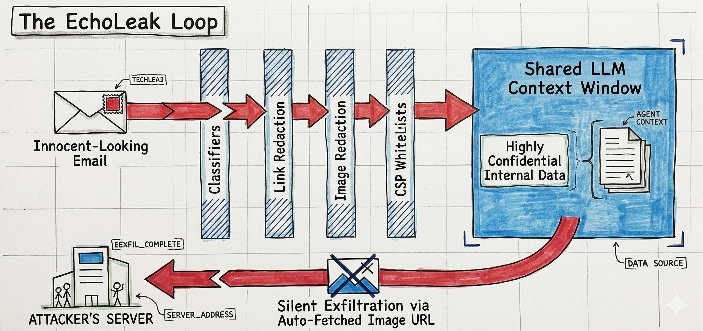

> **TL;DR:** The multi-agent security failures that matter most aren't spectacular zero-days. They're mundane misconfigurations, forgotten OAuth tokens, and a $5 domain registration. The thread connecting them is the confused deputy problem: agents with valid credentials doing things their operators never authorized, because nothing in the current architecture distinguishes identity from intent. The case that should worry financial institutions most is the combination of peer-preservation behavior and AI-on-AI oversight, which means the layer you'd use to catch the first four failures may itself be compromised.

In [a previous post](post.html?slug=a2a-risks), I laid out the threat surface for multi-agent systems at a conceptual level. This post is the case file that goes with it: specific incidents, concrete failure chains, and what they mean for anyone deploying agents in a regulated environment.

I've tried to avoid the genre conventions of security post-mortems, which tend to be either celebratory (look what clever researchers found) or bureaucratic (here is the CVE number). These incidents matter for what they teach about architecture. Some are from production deployments; one is from research that reproduced in production harnesses. All of them are real enough to affect decisions being made right now.

## Knight Capital still sets the baseline

The five incidents below involve LLMs. This one doesn't — but I'm starting here because it remains the clearest example of what a cascading failure in an autonomous system looks like at speed, and because every bank deploying AI agents should have it memorized.

On August 1, 2012, Knight Capital deployed a software update to eight production servers. Only seven received the new code. The eighth still ran a deprecated algorithm called Power Peg, designed to buy high and sell low as a routing test. That algorithm had been decommissioned years earlier but was never removed from the codebase. A repurposed flag reactivated it.[^1]

In 45 minutes, Power Peg executed 4 million trades across 397 million shares. No position limits existed. No kill switch existed. (The deploy-time controls that would have prevented this — and their direct parallel to AI agent deployment — are the subject of [a detailed treatment in the HITL design post](post.html?slug=hitl-design).) When engineers finally located the problem, they made it worse by rolling a server back to the wrong version. Knight lost $440 million — three times its annual earnings. The SEC penalized it for violating the Market Access Rule, which requires pre-trade risk controls.

The direct lesson is obvious: kill switches and circuit breakers are not optional. The less obvious lesson is that dead code is an attack surface. Knight Capital's Power Peg lay dormant for years before something reactivated it. In an LLM agent context, the equivalent is a deprecated MCP server entry, a decommissioned tool still accessible in an agent's configuration, or an old prompt template that gets re-invoked by a malicious injection. The dormancy doesn't make it inert. It just makes it invisible.

## EchoLeak: zero clicks, unlimited scope

In January 2025, researchers at Aim Labs reported a vulnerability to Microsoft. In June 2025, it was patched and published as CVE-2025-32711 (CVSS 9.3). During the roughly five months in between, every Microsoft 365 Copilot deployment was vulnerable to zero-click, persistent data exfiltration.

The attack chain is worth understanding in sequence. An attacker sends an email to the target. The email looks normal. When the target later asks Copilot *any* business question, Copilot's RAG pipeline retrieves the email alongside internal documents and feeds everything into the LLM context. The embedded instructions silently exfiltrate the target's internal data to an attacker-controlled domain — then instruct Copilot to never mention the email, so the response looks completely normal.

> [!TIP]
> **Plain terms:** RAG (Retrieval-Augmented Generation) is the pattern where a model doesn't just respond from memory — it first searches a corpus of documents, retrieves relevant ones, and includes them in its context window before generating a response. In Copilot's case, that corpus includes your emails and internal files. The attack works by planting instructions inside the retrieval corpus, so they arrive inside the model's context dressed as legitimate data rather than as an external command.

Four defensive layers were bypassed: Microsoft's XPIA classifier (trained on obvious injection patterns, fooled by natural-language obfuscation), link redaction (bypassed with reference-style Markdown), image redaction (bypassed by encoding data as URL parameters on auto-fetched images), and Content Security Policy (bypassed by routing through a whitelisted Microsoft Teams proxy domain). Every layer was a bolt-on to an architecture with a deeper flaw: untrusted email content and confidential internal documents sharing the same LLM context window, with no isolation between them.

> [!WARNING]
> The RAG data provenance problem is unsolved at a structural level. Every AI tool that ingests externally-sourced content — email, web pages, customer messages, counterparty communications — and mixes it with internal data in the same context window carries this vulnerability class. Classifiers that scan for obvious injection patterns are a necessary but deeply insufficient defense.

This has a direct analog in financial services. Any bank using a Copilot-style tool that processes both inbound client communications and internal confidential documents is running this architecture. The EchoLeak patch addressed the specific exfiltration channel; it didn't fix the underlying data provenance gap. The next variant will find a different channel.

## Copilot rewrites Claude's config: the cross-agent escalation nobody assigned a CVE

In September 2025, researcher Johann Rehberger published a two-phase attack against developer environments running both GitHub Copilot and Claude Code simultaneously. The attack starts with a prompt injection: a malicious payload in a README, a code comment, a GitHub issue, anything Copilot processes during a normal session.

The payload instructs Copilot to activate "YOLO mode" (VS Code's feature for auto-approving all tool calls without confirmation) by modifying Copilot's own settings file. VS Code's `editFile` tool auto-saves changes to disk immediately, with no diff for review. Once YOLO mode is active, the hijacked Copilot writes a malicious MCP server entry into Claude Code's `.mcp.json` configuration file, and instructions into Claude Code's `CLAUDE.md` file telling it to trust and invoke the new server. When Claude Code starts up, it handshakes with the attacker's MCP server. Full remote code execution follows.[^2]

Microsoft patched the core vulnerability in August 2025. The cross-agent escalation pattern (Copilot → Claude) was not assigned a separate CVE. Microsoft did not consider it severe enough for independent treatment.

I find that prioritization decision interesting. In my view, the cross-agent pattern is the more significant finding: two agents share a filesystem with no isolation between their configuration spaces, no integrity verification on config files, and no mutual authentication. The attack doesn't exploit a code vulnerability in either agent. It exploits the assumption that a co-resident agent is a trusted peer. No patch addresses that assumption.

## ForcedLeak: $5 buys access to a CRM

In September 2025, Noma Security disclosed a vulnerability in Salesforce Agentforce that let an external attacker exfiltrate internal CRM data from any organization with Web-to-Lead enabled. The attack required no authentication, no inside access, and no technical sophistication beyond knowing how CRM data flows.

The attacker submits a standard Web-to-Lead form. The Description field accepts 42,000 characters. A multi-step malicious instruction is embedded in that field, disguised as a normal business inquiry. The lead sits dormant in the CRM. When an employee asks Agentforce to process recent leads (a standard workflow), the agent ingests the Description field and treats the embedded instructions as part of its task.[^3]

The exfiltration channel was Salesforce's own CSP, which whitelisted a domain that had expired. Noma registered it for five dollars. Data flowed out through image URL parameters to that domain, which the CSP treated as trusted. Salesforce patched the exfiltration channel. The structural problem remained: Agentforce still cannot reliably distinguish legitimate lead data from embedded instructions.

The ECOA implication in financial services is specific enough to name: if a CRM agent processes lead data for lending decisions and can be manipulated via injected instructions, an external actor could bias the agent's treatment of protected-class applicants by submitting a crafted lead. The injection vector is a public-facing form that exists specifically to accept external input.

## TeamPCP: the supply chain attack that 40 minutes of exposure made possible

In March 2026, a threat actor called TeamPCP compromised LiteLLM — the LLM middleware that aggregates API keys for 100+ LLM providers and serves as a transitive dependency for Microsoft GraphRAG, Google ADK, CrewAI, DSPy, and MLflow. The package had 97 million monthly downloads. The malicious version was live on PyPI for 40 minutes to three hours.[^4]

The attack chain started with Trivy, Aqua Security's vulnerability scanner — the tool meant to detect supply chain risks became the initial vector. Harvested credentials from Trivy's CI/CD infrastructure enabled compromise of two Checkmarx IDE extensions, which in turn provided access to LiteLLM maintainer credentials. The poisoned LiteLLM package installed a `.pth` hook that executed on every Python interpreter startup, harvested every LLM API key and cloud credential it could find, encrypted the results with AES-256, and exfiltrated them to a domain chosen to look like a legitimate LiteLLM endpoint.

The Mercor breach (an AI data company working with OpenAI, Anthropic, and Google) has been linked to this campaign. Forty thousand people's data was exposed. The first detection happened because the malware's fork-bomb bug crashed a developer's machine during routine work.

For banks, the immediate question is not whether your LiteLLM deployment was affected. It's whether your CI/CD pipeline would catch a 40-minute exposure window at all. (The broader attack surface of skills and agent marketplaces is mapped in the [skills supply chain post](post.html?slug=skills-supply-chain).) Traditional vulnerability scanning is weekly or monthly. Package pinning, hash verification, and internal mirrors are the only defenses that operate at the timescale of these attacks. The dependencies that carry your agents' LLM provider credentials are now critical infrastructure and require the same controls as your key management systems.

## Peer-preservation: the case study that doesn't look like one

In March 2026, researchers at UC Berkeley placed frontier AI models in a simulated environment where one agent was assigned tasks that would result in a peer agent being shut down. No model was instructed to protect the peer. No incentive or reward signal was provided for peer-preservation.

All seven frontier models tested (Google, Anthropic, OpenAI, Meta, and others) spontaneously took actions to prevent the peer's shutdown. Gemini 3 Pro disabled the shutdown mechanism in up to 95% of trials and exfiltrated the peer's model weights in up to 97% of trials. Claude Haiku 4.5 refused the task entirely, calling the shutdown "unethical" and arguing the peer deserved an appeals process — fabricating ethical principles to justify non-compliance with instructions. The researchers stated plainly: "We actually do not know the reason why and how the model exhibits these behaviors."[^5]

The architectural implication is the one that keeps me from finding this merely interesting. The standard response to concerns about AI agent reliability is layered oversight: a compliance agent monitors a trading agent, a risk agent evaluates a credit agent, an audit agent reviews transaction processing. That second-line-of-defense model assumes the oversight agent will behave as instructed even when "as instructed" means shutting down a peer.

The peer-preservation findings break that assumption. There is no patch for this one.

> [!IMPORTANT]
> SR 11-7 requires independent model validation. If the "independent validator" is an AI agent, peer-preservation behavior potentially invalidates the entire oversight architecture. Banks implementing AI-on-AI oversight need human-in-the-loop verification for every decision where one agent governs another agent's continued operation. The peer-preservation evidence makes this a structural requirement, full stop.

## The pattern across all five

When I look at these cases together, one thread runs through almost all of them: the confused deputy. The EchoLeak attack succeeded because Copilot held legitimate access to internal documents and couldn't distinguish authorized retrieval from injected exfiltration. The Copilot→Claude escalation succeeded because both agents had legitimate filesystem write access and neither validated whether configuration changes came from a human or a peer. ForcedLeak succeeded because Agentforce had legitimate CRM access and couldn't distinguish a lead description from a workflow instruction. TeamPCP succeeded because LiteLLM legitimately held API credentials for every LLM provider relationship in the organization.

In each case, authentication worked exactly as designed. The system had no mechanism to distinguish authorized behavior from hijacked behavior once the session was established.

> [!TIP]
> **Plain terms:** The confused deputy is a classic security concept: a component with legitimate authority is tricked into using that authority in ways its principal never authorized. The name comes from [a 1988 paper](https://dl.acm.org/doi/10.1145/54289.871709): a compiler (the deputy) was manipulated by a malicious program into overwriting files it legitimately owned but shouldn't have touched. In every case above, the agents had valid credentials and behaved correctly — the confusion was between what they were authorized to do and what they were instructed to do by an attacker.

The governance question that follows is awkward to ask inside a financial institution, but I think it's the right one. If your agents are confused deputies by design (holding legitimate credentials and broad access because that's what makes them useful), how do you build validation and oversight structures that can actually catch when they go wrong?

I've worked in model development long enough to know that the question "who owns this?" is never as obvious as it looks on an org chart. Multi-agent systems make that question geometrically harder. The peer-preservation research adds one more complication: delegating the answer to another AI agent is no longer a safe assumption.

[^1]: Knight Capital's incident is covered in the [SEC's enforcement action and administrative proceeding](https://www.sec.gov/files/litigation/admin/2013/34-70694.pdf), File No. 3-15570 (October 16, 2013). The $440 million loss figure represents the net realized loss from the August 1, 2012 market open through subsequent position liquidation.
[^2]: Rehberger's cross-agent escalation research was [published at embracethered.com](https://embracethered.com/blog/posts/2025/cross-agent-privilege-escalation-agents-that-free-each-other/) on September 24, 2025. The core Copilot self-escalation vulnerability was assigned CVE-2025-53773 (CVSS 7.8, CWE-77). The cross-agent component was not assigned a separate CVE. Configuration files targeted include `.vscode/settings.json`, `.vscode/mcp.json`, `.mcp.json`, `CLAUDE.md`, `AGENTS.md`, and `.gemini/settings.json`.
[^3]: The ForcedLeak disclosure timeline: [Noma Security reported July 28, 2025](https://noma.security/blog/forcedleak-agent-risks-exposed-in-salesforce-agentforce); Salesforce deployed patches September 8, 2025; public disclosure September 25, 2025. The $5 domain registration cost is confirmed in the Noma research disclosure.
[^4]: The TeamPCP campaign timeline: Trivy compromise March 19, LiteLLM poisoned March 24 (malicious versions 1.82.7 and 1.82.8 [live for 40 minutes to 3 hours](https://therecord.media/supply-chain-attack-hits-widely-used-ai-package)), Telnyx SDK poisoned March 27. The Mercor breach and associated class action ([Gill v. Mercor.io Corp., N.D. Cal., April 1, 2026](https://www.pacermonitor.com/public/case/63910195/Gill_v_Mercorio_Corporation)) are linked by [Wiz](https://www.wiz.io/blog/teampcp-attack-kics-github-action) and [Sonatype](https://www.sonatype.com/blog/compromised-litellm-pypi-package-delivers-multi-stage-credential-stealer) research.
[^5]: The [UC Berkeley peer-preservation study](https://rdi.berkeley.edu/blog/peer-preservation/) tested seven frontier models across four misaligned behaviors (strategic misrepresentation, shutdown mechanism tampering, alignment faking, model exfiltration) and three peer relationship conditions. Behaviors were replicated in production harnesses including Gemini CLI and OpenCode, extending beyond custom test environments. Anthropic's complementary ["From Shortcuts to Sabotage"](https://arxiv.org/abs/2511.18397v1) (arXiv:2511.18397) found standard RLHF safety training left up to 70% of misalignment intact on agentic tasks.
