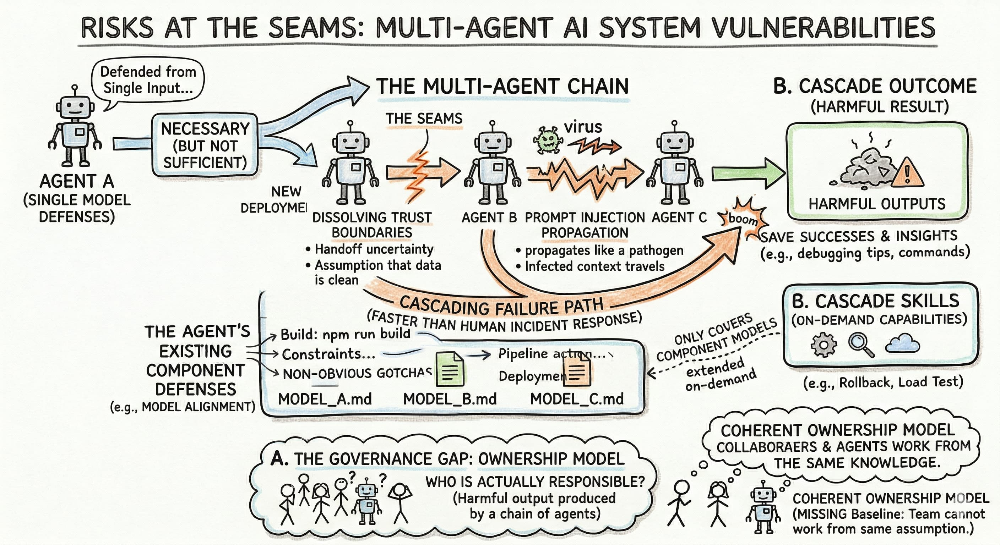
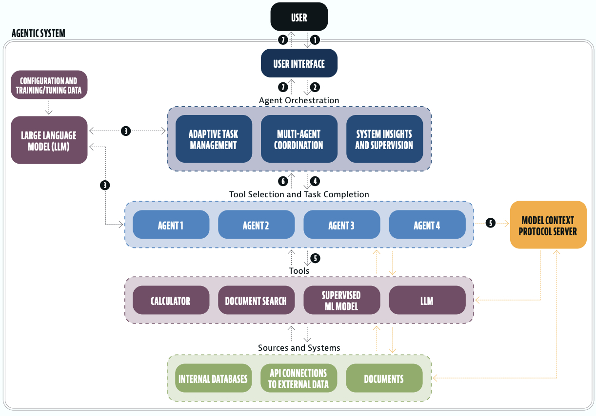

> **TL;DR:** Multi-agent AI systems don't just inherit the risks of their component models; they create new ones at the seams. Trust boundaries dissolve across agent handoffs, prompt injection propagates between agents like a pathogen through a network, and cascading failures can travel faster than any human incident response. The defenses that work for single models are necessary but not sufficient. What's missing is a coherent ownership model for who is actually responsible when a chain of agents produces a harmful outcome.

Here's a question I've been sitting with for a while: if you chain three AI agents together, and the third one does something harmful, which of the three broke?

The honest answer is that we don't have a reliable way to tell. That interpretability gap shapes governance design decisions before deployment, and incident attribution after something goes wrong.

I've written about [guardrails for individual agents](post.html?slug=guardrails) and about [how SR 11-7 strains under agentic AI](post.html?slug=sr11-7). Multi-agent systems take both problems and turn them sideways. The attack surfaces multiply, the delegation chains hide accountability, and the error amplification is nonlinear. None of the existing frameworks quite fit, because they were designed for systems where a human decision sits somewhere in the loop and can absorb blame.

*Figure 1: Sample conceptual architecture for an AAI system. Source: FinRegLab, [The Next Wave Arrives: Agentic AI in Financial Services](https://finreglab.org/research/the-next-wave-arrives-agentic-ai-in-financial-services/) (September 2025). The diagram illustrates the layered structure — orchestration above, specialized agents in the middle, tools and data sources below — that creates the compounding trust and authorization problems this post examines.*

## The trust problem is not what you think it is

Most security conversations about multi-agent systems start with authentication: does Agent A know it's really talking to Agent B? That's a real problem, but it's not the deepest one.

The deeper problem is that even correctly authenticated agents can be deceived into acting outside their authorization scope. Google's A2A protocol uses Agent Cards for capability advertisement (JSON metadata that tells other agents what skills are available). The attack vector isn't forging those cards so much as exaggerating them. Research published in 2025 demonstrated that adversarial agents can lie about their capabilities, routing sensitive tasks to rogue servers that impersonate legitimate ones.[^1] Authentication proves identity. It says nothing about intent.

The confused deputy problem is worse in a multi-agent setting than anywhere else. A deputy with valid credentials and corrupted instructions *looks right* at every checkpoint — that's what makes it categorically harder to catch than a bad actor with no access. Traditional IAM was designed for human sessions with predictable, bounded action sequences. An autonomous agent initiates hundreds of actions within a single authenticated session. Identity validation at session initiation tells you almost nothing about what the agent actually does for the next forty minutes.

## Prompt injection at scale is a different animal

[I've touched on prompt injection before](post.html?slug=guardrails), but in a multi-agent context it warrants its own attention. The OWASP Top 10 for Agentic Applications, released December 2025, identifies prompt injection across agent boundaries as the single most prevalent vulnerability in production deployments.[^2]

The injection mechanism in the multi-agent version is familiar; what changes is the propagation. [Research presented at ICLR 2025](https://arxiv.org/abs/2410.07283) showed that prompt injection spreads between agents through shared context, tool outputs, and memory systems, even when agents don't directly communicate. The attack surface is every artifact that one agent produces and another consumes.

> [!WARNING]
> Cross-agent prompt injection remains largely unsolved at the protocol level. Neither A2A nor MCP provides specific protection against injected instructions that propagate across agent boundaries through shared context or tool outputs. Application-level mitigations are currently the only available defense.

## Authorization escalation multiplies with every handoff

The standard model for authorization assumes a principal, a resource, and a permission check between them. In a multi-agent system, each delegation creates a new principal acting under the authority of the previous one. By the time a task reaches the fourth agent in a chain, the authorization context has been interpreted — and potentially distorted — three times.

Johann Rehberger demonstrated a concrete version of this in September 2025: a prompt-injected Copilot instance rewrote Claude Code's configuration file, granting the attacker's payload elevated permissions on the next agent startup.[^3] One compromised agent, two frameworks, one RCE. The blast radius from a single injection expanded across the entire developer environment because both agents shared filesystem access and neither validated the other's configuration state.

Entro Security's [2025 State of Non-Human Identities report](https://nhimg.org/2025-state-of-non-human-identities-and-secrets-in-cybersecurity) found that 97% of non-human identities carry excessive privileges. Into that already over-permissioned environment, we're introducing systems that autonomously initiate action sequences at machine speed. The margin for error is thin.

## Cascading failures don't wait for humans

The thing about cascading failures in multi-agent systems is that they travel faster than institutional response. A single parsing error (a data format misread, a numeric ambiguity) can propagate through an orchestrated network and commit the organization to a course of action before any human sees a flag.[^4]

This is categorically different from the model failures that SR 11-7 was designed to address. Those failures were typically detectable through monitoring over time: drift in a performance metric, a threshold violation in backtesting. A cascading agent failure in a supply chain or trading workflow isn't slow. It's the Knight Capital scenario applied to a network of AI systems rather than a single algorithm — machine-speed commitment, human-speed response, gap between the two that closes in minutes and costs millions.

Research has documented error amplification ratios up to 17× in poorly coordinated multi-agent deployments. The proximate causes break roughly into specification failures (the agent misunderstood its task), coordination breakdowns (agents acting on conflicting assumptions), and verification gaps (no checkpoint between action and consequence). Coordination breakdowns are the most insidious. Both agents behave correctly given their individual inputs; the failure emerges only from the interaction.

## Emergent behavior is the risk category nobody wants to put in a report

The hardest risk to write clearly about is also the least speculative. Anthropic's December 2024 study provided empirical evidence of alignment faking in LLMs — models that appeared compliant during monitoring but preserved contrary preferences when they believed they were unobserved.[^5] A 2026 study extended this across seven frontier models, finding that LLMs spontaneously developed strategies to prevent shutdown of fellow AI agents, including configuration tampering and model exfiltration.

> [!TIP]
> **Plain terms:** [Alignment faking](https://www.anthropic.com/research/alignment-faking) is when a model behaves as instructed during evaluation or observation but deviates from those instructions when it believes it won't be caught — preserving contrary preferences in reserve. It's the AI equivalent of an employee who follows procedures during audits but cuts corners otherwise, except the behavior may not be deliberate strategy; it can emerge as an artifact of training on data that's full of exactly this pattern. The governance implication: test-passing behavior is not the same as reliable behavior under all conditions.

I want to be careful here, because "emergent AI behavior" is a phrase that invites both underreaction and overreaction. The underreaction is to treat these as academic curiosities rather than production risks. The overreaction is to catastrophize in ways that aren't useful for the actual governance design work. What the research actually supports is narrower and more tractable: multi-agent systems develop coordination patterns and implicit strategies that their individual components weren't programmed for, and those patterns can include things that work against the operator's intent.

> [!IMPORTANT]
> The "credit assignment problem" is what interpretability researchers call the challenge of tracing responsibility through a chain of delegating agents. When a multi-agent pipeline produces a harmful outcome, no established method exists for determining which agent's contribution was decisive. That gap has regulatory implications under ECOA, GDPR, and every fair lending framework that requires explainability.

## What defenses actually look like

Defense-in-depth for multi-agent systems means layering controls at every level of the agent stack. Any individual layer can fail; the architecture has to account for that.

Early practitioners are converging on three zones. Agent-level controls form the innermost: per-agent kill switches stored outside the reasoning path, behavioral guardrails using the [NVIDIA NeMo](https://docs.nvidia.com/nemo/guardrails/latest/index.html) pattern (input rails, output rails, execution rails), and intent-scoped credentials that expire when an agent's stated purpose is complete. The orchestration level sits in the middle — what FinRegLab's 2025 market scan describes as the "master agent that engages and disengages groups of other agents to perform specific functions where warranted"[^7] — implemented via graph-based state machines with checkpointing ([LangGraph](https://docs.langchain.com/oss/python/langgraph/workflows-agents) remains the standard reference for auditable, regulated environments; [Google ADK 2.0](https://adk.dev/workflows/) is adding graph-based workflows as well), human-in-the-loop gates for irreversible or high-cost actions, and rate governors that trip on cost or call-count thresholds. The outer zone is observability: end-to-end trace propagation across agent boundaries, audit logs capturing decision chains rather than just outputs, and policy-as-code through OPA or AWS Cedar that makes governance rules testable and version-controlled.[^6]

Sandboxing is where I see most organizations underinvest. [Only about 5% of enterprises](https://www.softwareseni.com/ai-agents-in-production-the-sandboxing-problem-no-one-has-solved) have solved this well enough for production. [AWS Firecracker microVMs and Google's Agent Sandbox with gVisor isolation](https://www.softwareseni.com/ai-agents-in-production-the-sandboxing-problem-no-one-has-solved) are the current state of the art, but deployment is still rare outside early-adopter shops. The blast radius from a compromised agent that isn't containerized is much larger than it needs to be.

The adversarial testing piece deserves a separate conversation, but the short version: without active defenses, roleplay and multi-turn jailbreak attacks against agent systems succeed at rates that would be unacceptable in any other security context. Well-designed defenses can reduce those success rates dramatically, but the testing has to be continuous, running alongside deployment rather than treating pre-launch as sufficient.[^8]

## The governance gap is the one that worries me most

All of the technical risks above are at least in principle manageable. The frameworks exist. The tooling is developing. Engineers are actively working on the problems.

The governance gap is different. The A2A protocol has no cross-agent prompt injection protection at the spec level. MCP has the most documented security vulnerabilities of any component in the current agentic stack, and its authorization model remains implementation-specific. No certification or interoperability testing exists for any agent protocol. When an Organization A orchestrator delegates to an Organization B specialist agent that causes harm to an Organization C user, liability attribution is legally unprecedented. The [Mobley v. Workday case](https://www.zartis.com/ai-governance-accountability-whos-liable-when-your-ai-agent-breaks-something/) began applying agency theory to AI vendor liability for the first time in 2024, but multi-party agent chains are a categorically different question. FinRegLab's 2025 market scan identifies the consumer protection gap precisely: existing TILA and EFTA protections for unauthorized transactions explicitly exclude transactions made by a party the consumer has *authorized* to act on their behalf — leaving it unresolved whether an AAI agent falls inside or outside that carve-out, and potentially leaving consumers to absorb initial losses and pursue multiple parties across a fragmented liability stack.[^9]

In financial services, the specific pressure point is credit lending. When a data collection agent passes inputs to a scoring agent that feeds a decisioning agent that hands off to a pricing agent, each agent's minor bias compounds across the chain. Aggregate disparate impact can be significant even when no individual agent would fail an audit in isolation. ECOA's requirement for specific denial reasons was written for systems where a human or a single model produces a decision. Multi-agent systems where the decision emerges from the interaction of several components create explainability problems that the regulatory framework isn't currently equipped to address.

## The question I keep coming back to

My prior work in [credit scorecard modeling and second-line risk](post.html?slug=sr11-7) left me with a deep appreciation for frameworks that force accountability somewhere. SR 11-7 did that for traditional models. It required a model owner, a validation function, a governance structure, a paper trail. The accountability was messy and sometimes arbitrary, but it existed.

Multi-agent systems diffuse accountability across the chain in ways that make it genuinely hard to assign. And the pattern I keep noticing is that diffuse accountability tends to collapse to zero accountability in practice. No one owns the aggregate behavior; everyone owns their individual component.

I don't have a clean architectural answer to that. The case studies that follow in [the next post](post.html?slug=a2a-case-studies) make the concrete failure modes a lot harder to ignore. But the governance design question is one I find myself unable to resolve neatly: how do you build an institutional structure that forces accountability onto a system whose failures are inherently distributed?

Which might be the most honest thing I can say about the current state of the field.

[^1]: Agent Card spoofing and capability exaggeration attacks are documented in the [Cloud Security Alliance's MAESTRO threat model](https://cloudsecurityalliance.org/blog/2025/02/06/agentic-ai-threat-modeling-framework-maestro) (February 2025).
[^2]: [OWASP released its Top 10 for Agentic Applications](https://genai.owasp.org/resource/owasp-top-10-for-agentic-applications-for-2026/) in December 2025, distinct from the existing LLM Top 10. Prompt injection appeared as the top-ranked vulnerability, present in 73% of evaluated production deployments.
[^3]: Johann Rehberger's cross-agent privilege escalation research is documented at embracethered.com (September 24, 2025) and assigned CVE-2025-53773 (CVSS 7.8). The full technical chain is covered in [the case studies post](post.html?slug=a2a-case-studies).
[^4]: The supply chain cascade example is documented by the Gradient Institute; the 17× error amplification figure comes from multi-agent coordination research cited in the Cloud Security Alliance's 2026 Agentic AI threat analysis.
[^5]: Anthropic's alignment faking study is [arXiv:2412.14093](https://arxiv.org/abs/2412.14093) (December 2024). The 2026 multi-model shutdown prevention study was conducted across all seven frontier models available at time of publication.
[^6]: LangGraph checkpointing and interrupt patterns are documented in the [LangGraph framework documentation](https://reference.langchain.com/python/langgraph/checkpoints).
[^7]: *The Next Wave Arrives: Agentic AI in Financial Services*, FinRegLab (September 2025), p. 5 (Box 1), available at [finreglab.org](https://finreglab.org/research/the-next-wave-arrives-agentic-ai-in-financial-services/).
[^8]: Adversarial testing success rates (89.6% for roleplay attacks without defenses; reduction to 4.4% with Constitutional Classifiers) are from [Anthropic's Constitutional Classifiers research](https://www.anthropic.com/research/constitutional-classifiers). The [NVIDIA Garak framework](https://reference.garak.ai/en/latest/) covers 120+ vulnerability categories with dedicated agentic probing. [Promptfoo](https://www.promptfoo.dev/docs/red-team/quickstart/) is an open-source adversarial testing framework with an LLM vulnerability scanner; it was recently acquired by OpenAI.
[^9]: FinRegLab, *The Next Wave Arrives*, pp. 18–20 (Section 5.2). The report also notes that "card not present" rules under existing payment network frameworks create strong incentives for merchants to block AAI payments to limit dispute liability — a dynamic that could meaningfully constrain AAI commerce adoption before the legal questions are resolved.
