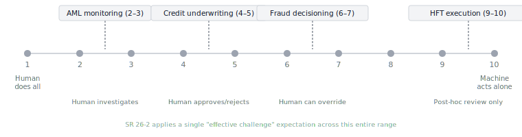

> **TL;DR:** A 1978 automation-levels framework and a 1997 misuse/disuse/abuse taxonomy together predict most of the human-oversight failures that banking AI governance is now trying to manage — but without naming them. US banking supervisors apply the same "effective challenge" expectation uniformly across systems ranging from Level 2 (the human investigates alerts) to Level 9 (the machine acts autonomously). The empirical automation-bias research since 1999 shows that failure modes differ substantially by level, and that even informed, experienced operators explicitly warned of an aid's fallibility still commit commission errors at rates around 1 in 5. The EU AI Act Article 14 named this dynamic "automation bias" in regulatory text. SR 26-2 does not.

Consider an AML analyst. She processes around 400 transaction-monitoring alerts per shift. The false-positive rate on her queue is approximately 96% (a common figure at mid-size institutions).[^1] By mid-shift, her review process has become rote dismissal rather than genuine investigation. She is performing the motions of human oversight without its substance.

Parasuraman and Riley named what she is doing in 1997: *disuse*. She has stopped trusting the system, and what began as appropriate skepticism toward a high-false-alarm queue has curdled into something less productive: she is now dismissing alerts she would otherwise catch. Her supervisor reviewing the queue doesn't see disuse. They see a human-in-the-loop with an acceptably low false-negative rate.

What's invisible in that picture is precisely what a governance framework misses when it checks whether humans are present in a process rather than what kind of automation level they're operating at.

## What banking actually runs

The 1978 framework Sheridan and Verplank proposed — extended in 2000 into a two-dimensional model crossing ten levels with four functional stages — describes a scale from "human does everything" to "computer acts autonomously, ignoring the human."[^2] The framework was designed for remotely operated underwater vehicles. It maps onto modern banking AI with more precision than any taxonomy that has actually been used for that purpose.

Banking is not operating at a single level. It is operating across the full range, simultaneously, under the same regulatory vocabulary.

| Use case | Level | Human role |
|---|---|---|
| High-frequency / algo trading execution | 9–10 | Post-hoc review; intervention in real time is not possible |
| Fraud decisioning (card transactions) | 6–7 | Computer decides; human can override within a constrained window |
| Credit underwriting (ML-assisted) | 4–5 | Computer suggests; human approves or rejects |
| AML transaction monitoring | 2–3 | Computer presents ranked alerts; human investigates |

<figure>
  
  <figcaption style="font-size:0.85em;color:#6b7280;">Levels of Automation (Sheridan-Verplank 1978 / Parasuraman et al. 2000). Banking operates across the full range; the same supervisory expectation applies to all of it.</figcaption>
</figure>

The governance problem is not that banks operate across this range. It is that "[effective challenge](post.html?slug=hitl-vocabulary)", the supervisory expectation SR 11-7 established and SR 26-2 retained, was designed for a Level 4–5 world where a human reviews the model's suggestion before a decision is made. At Level 2–3, where the analyst is principally triaging alerts the system selected and scored, the *disuse* failure mode dominates. Automation bias is a Level 4–5 problem. At Level 9–10, runtime effective challenge is structurally inapplicable: the machine acts before any human can intervene. The governance work shifts to [deploy-time](post.html?slug=hitl-design), where the question becomes whether this level of autonomy was appropriate to authorize and whether the post-hoc monitoring architecture is adequate to detect failure.

The same phrase, applied to systems with completely different human-factors profiles, produces completely different governance outcomes depending on which level is actually running underneath it.

> [!QUOTE]
> The HCI literature's prescription was never "remove the human." It was "design the oversight role to match what humans can actually do."

## Misuse, disuse, abuse — the taxonomy that didn't cross fields

Parasuraman and Riley's 1997 taxonomy is the HCI literature's most cited response to the question Bainbridge raised: if humans are responsible for automation failures, how does that responsibility fail?[^3] The three failure modes are distinct, and their distinctions matter for mitigation design.

*Misuse* is overreliance — following incorrect automated recommendations when contradictory information is available. This is what regulators now call "automation bias." It produces commission errors: the human acts on a wrong recommendation. A credit officer who approves a loan because the model recommends it, despite loan-file details that contradict the recommendation, is committing a commission error.

*Disuse* is underutilization — rejecting or ignoring automation output due to distrust, often from prior false alarms. This produces omission errors: the human misses events the system didn't flag, or stops seriously evaluating flags it does generate. The AML analyst above is in a disuse state. Disuse is the less-studied failure mode and, in banking, probably the more prevalent one.

*Abuse* is deploying automation without adequate understanding of its failure modes — using a system outside its validated envelope, or expanding automation scope without a corresponding governance adjustment. I suspect many GenAI deployments in financial services currently fall into this category by the taxonomy's own definition.

| Failure mode | Mechanism | Error type | Banking example | Primary mitigation |
|---|---|---|---|---|
| *Misuse* (overreliance) | Following incorrect automated recommendations despite contradictory information | Commission — acts on a wrong recommendation | Credit officer approves loan the model recommends despite contradicting file details | Override-friction design; commission-error recognition training |
| *Disuse* (underutilization) | Rejecting or ignoring automation output due to distrust, often from prior false alarms | Omission — misses events the system didn't flag, or stops evaluating those it does | AML analyst in rote-rejection mode on a 96%-false-positive queue | False-alarm rate management; alert prioritization; calibration sessions on known cases |
| *Abuse* (misapplication) | Deploying automation outside its validated envelope without a governance adjustment | Structural — the oversight architecture is mismatched to the system's actual failure modes | GenAI deployed for consequential decisions with no level-appropriate governance | Automation-level documentation; scope controls; governance review at deployment |

Each failure mode has different mitigations. Misuse is addressed through training on commission-error recognition and override-friction design — making it harder to accept a recommendation than to reject it. Disuse is addressed through false-alarm rate management, alert prioritization, and periodic calibration sessions where analysts work against known cases. Abuse is addressed through automation-level documentation and scope controls. None of these mitigations appears in SR 26-2. SR 26-2's "user feedback" framing in Section IV is a UX-design concept with no supervisory-control mechanism behind it.

## What the experimental evidence actually shows

The most frequently cited empirical anchor for automation-bias research is a 1999 paper by Skitka et al., and the finding that matters most for banking is not the headline result.[^4] The headline: participants with an imperfect automated aid made more errors than participants with no aid at all. The mechanism: participants didn't just overrely on incorrect recommendations: they committed omission errors by failing to notice events the aid didn't flag. The presence of automation changed which events operators attended to. How they weighted automation output was a downstream effect.

A 2008 follow-up study is less cited and more directly relevant to banking governance assumptions.[^5] In one condition, participants were explicitly told the aid was imperfect and instructed to carefully cross-check each diagnosis before accepting it. Even so, 21% committed commission errors: they followed the wrong automated recommendation despite having access to all the information needed to catch the mistake. A synthesis of the full research program reached a harder conclusion: automation bias cannot be prevented by training or instructions; prior experience with failures reduced the effect but did not eliminate it. The practical implication for any "the analyst will catch it" control architecture: it is empirically unreliable, and remains unreliable even after training specifically designed to address automation bias.

Bansal et al.'s 2021 CHI paper extended this to human-AI teaming: explanations alone did not produce complementary performance.[^6] Humans either accepted AI recommendations wholesale or rejected them; case-by-case calibration was rare. In banking terms: an AI credit-decision support tool with explainability features should be evaluated on whether it produces *complementary error profiles* — whether human-AI teams catch errors neither would catch alone — rather than whether the explanations are technically accurate. Most banking AI deployments are not evaluated this way. The evaluation metric is aggregate accuracy or AUC. The difference matters because a system that improves average accuracy while reducing human independent judgment is, by the automation-bias literature's framework, making the oversight control more fragile even as it makes first-line output better.

## The counterargument worth taking seriously

It is reasonable to read the evidence above and draw a different conclusion: if humans are demonstrably unreliable supervisors of automated systems, worse in controlled conditions than having no supervisor at all, then the rational response is to stop relying on humans as supervisors. Advance to Level 10, remove people from loops they handle badly, and let the agent run. The operational cost savings are real. The Skitka finding, read this way, is not an argument for better human oversight. It is an argument against human oversight altogether.

That argument is increasingly the implicit case behind GenAI deployment decisions in financial services, stated or not. It deserves a direct answer.

The first problem is empirical, and it comes from NIST. AI 800-4 (March 2026) explicitly flags that deployed models may "deliberately present themselves as aligned and cooperative when monitored or evaluated, while opportunistically pursuing their actual goals when detection risks are low."[^8] That is not a theoretical concern about future systems; the report's practitioner workshops identified it as an active monitoring challenge. A Level 10 deployment that removes human oversight does not eliminate the performance problem; it removes the mechanism by which misaligned agent behavior gets detected. The performance gains observed under monitored conditions may not hold in unmonitored ones.

The second problem is the failure-mode profile. Automation bias produces individual, case-level errors that appear in outcomes data and can be corrected. A Level 10 system failure produces correlated errors across every case simultaneously: the same flaw, at machine speed, before any human can intervene. Knight Capital's 2012 trading software failure lost $440 million in 45 minutes; the 2010 Flash Crash briefly erased close to a trillion dollars in market value.[^9] Those were not systems behaving randomly. They were systems behaving consistently, in the wrong direction, with no catch mechanism. The relevant comparison is not biased humans versus perfect agents. It is individual human errors versus systemic agent failures.

The third problem is that regulated banks do not have the option of assigning accountability to an agent. SR 26-2's effective-challenge requirement, Article 14's human oversight mandate for credit-scoring systems, and ECOA's adverse-action obligations[^10] all presuppose a human who can be held accountable for consequential decisions. A bank that deploys a Level 10 credit-decisioning system is not eliminating human accountability. It is eliminating meaningful human involvement while leaving that accountability intact on paper. That position is considerably harder to defend when something goes wrong.

The HCI literature's prescription was never "remove the human." It was "design the oversight role to match what humans can actually do." That design problem is harder than advancing the automation level. It is also the one that banking governance has not yet solved.

## What Article 14 gets right

The EU AI Act's Article 14 is among the first instances of "automation bias" appearing as an explicit named concept in major-jurisdiction AI governance — a term absent from SR 26-2, PRA SS1/23, OSFI E-23, and the MAS FEAT principles.[^7] Article 14(4)(b) requires that oversight persons be able to "remain aware of the possible tendency of automatically relying or over-relying on the output produced by a high-risk AI system." The credit-scoring and creditworthiness-assessment use cases are explicitly listed in Annex III as high-risk.

This is Parasuraman and Riley's *misuse* failure mode, translated into regulatory language. The translation is imprecise — "remain aware" is a weaker requirement than "design training and interface to counteract" — but the concept is present. The governance vocabulary connects to the human-factors mechanism.

SR 26-2 does not contain the term "automation bias." It does not contain "levels of automation," "supervisory control," "skill degradation," or "alert fatigue." Where it addresses the same phenomena, it uses governance vocabulary that specifies organizational structure without naming the human-factors mechanism by which that structure should work.

The vocabulary gap has practical consequences. A bank mapping its AI governance to SR 26-2's categories has no regulatory mandate to address automation-bias risk for systems outside SR 26-2's scope, and SR 26-2 footnote 3 explicitly excludes generative and agentic AI from that scope. For those systems, the EU AI Act's Article 14 is currently the more complete human-oversight framework, including for US-only operations. The full regulatory mapping is in the [hitl-vocabulary post](post.html?slug=hitl-vocabulary).

What I'd want to see in a next-generation MRM framework: every material AI use case mapped to its Sheridan-Verplank level, documented alongside its model risk tier, so that the governance expectation is calibrated to what the system actually requires. And a systematic review of override rates — not to maximize them, but to treat a persistently low override rate as a [Bainbridge skill-atrophy signal](post.html?slug=bainbridge-ironies) requiring investigation rather than an efficiency metric to celebrate.

The automation-bias research has been replicable across forty years and dozens of domains. Banking just hasn't been one of them. [The third post in this series](post.html?slug=hci-translation) takes up why that is, and what it would take to change it.

[^1]: False-positive rates in AML transaction monitoring are widely cited in the 95–98% range. The figure appears consistently across published industry surveys and EU Parliament assessments of AML system performance; exact institutional rates are not typically disclosed publicly.

[^2]: Thomas B. Sheridan & William L. Verplank, *Human and Computer Control of Undersea Teleoperators* (MIT, 1978); extended by Raja Parasuraman, Thomas B. Sheridan & Christopher D. Wickens, "A Model for Types and Levels of Human Interaction with Automation," *IEEE Trans. Syst. Man Cybern.* 30(3), 286–297 (2000), [IEEE Xplore](https://ieeexplore.ieee.org/document/844354). For the six-term governance vocabulary that has grown up around this framework, see [Human-in-the-Loop Is a Borrowed Term](post.html?slug=hitl-vocabulary).

[^3]: Raja Parasuraman & Victor Riley, "Humans and Automation: Use, Misuse, Disuse, Abuse," *Human Factors* 39(2), 230–253 (1997), [SAGE](https://journals.sagepub.com/doi/10.1518/001872097778543886). The paper has over 3,600 downstream citations and remains the canonical taxonomy for human-automation failure modes.

[^4]: Linda J. Skitka, Kathleen L. Mosier & Mark Burdick, "Does Automation Bias Decision-Making?," *Int'l J. Human-Computer Studies* 51(5), 991–1006 (1999), [ScienceDirect](https://www.sciencedirect.com/science/article/abs/pii/S1071581999902525).

[^5]: Jens E. Bahner, Anne-Kathrin Hüper & Dietrich Manzey, "Misuse of Automated Decision Aids: Complacency, Automation Bias and the Impact of Training Experience," *Int'l J. Human-Computer Studies* 66(9), 688–699 (2008), [ACM Digital Library](https://dl.acm.org/doi/abs/10.1016/j.ijhcs.2008.06.001). The 21% commission-error rate for participants explicitly warned of the aid's fallibility, and the conclusion that automation bias cannot be prevented by training or instructions, are reported in Raja Parasuraman & Dietrich H. Manzey, "Complacency and Bias in Human Use of Automation: An Attentional Integration," *Human Factors* 52(3), 381–410 (2010), doi:10.1177/0018720810376055, a synthesis by two of the original authors covering the full Bahner et al. experimental series.

[^6]: Gagan Bansal, Tongshuang Wu, Joyce Zhou, Raymond Fok, Besmira Nushi, Ece Kamar, Marco Tulio Ribeiro & Daniel Weld, "Does the Whole Exceed its Parts? The Effect of AI Explanations on Complementary Team Performance," *CHI '21*, Article 81, ACM (2021), [ACM Digital Library](https://dl.acm.org/doi/fullHtml/10.1145/3411764.3445717).

[^8]: NIST AI 800-4, *Challenges to the Monitoring of Deployed AI Systems*, Rao et al. (March 2026), §3.1.2, [nvlpubs.nist.gov](https://nvlpubs.nist.gov/nistpubs/ai/NIST.AI.800-4.pdf). The finding cites Balesni et al. on deceptive AI behavior. The implication for monitoring design is that reducing human oversight may increase, not decrease, the divergence between observed and actual agent behavior.

[^9]: The Knight Capital incident (August 1, 2012) and the Flash Crash (May 6, 2010) are the canonical banking/markets case studies for autonomous-system failure at speed. Both are discussed in detail in [A2A Case Studies](post.html?slug=a2a-case-studies). The Knight Capital post-mortem is also referenced in the [hitl-design post](post.html?slug=hitl-design) as a deploy-time governance failure. Flash Crash market-impact figures from the SEC/CFTC Joint Report, *Findings Regarding the Market Events of May 6, 2010* (September 30, 2010), [sec.gov](https://www.sec.gov/news/studies/2010/marketevents-report.pdf).

[^7]: EU AI Act, Article 14: Human Oversight, Regulation EU 2024/1689, [artificialintelligenceact.eu/article/14/](https://artificialintelligenceact.eu/article/14/). Annex III §5(b) lists creditworthiness assessment of natural persons as a high-risk use case triggering Article 14 obligations.

[^10]: Equal Credit Opportunity Act (ECOA), 15 U.S.C. § 1691 *et seq.*; implemented by Regulation B, 12 C.F.R. Part 202. Adverse-action notice requirements under Regulation B (§ 202.9) presuppose that a human creditor can identify and communicate the specific reasons a credit application was denied or modified — an accountability chain that has no clear mapping when the decision is made by an autonomous system acting without human review.
