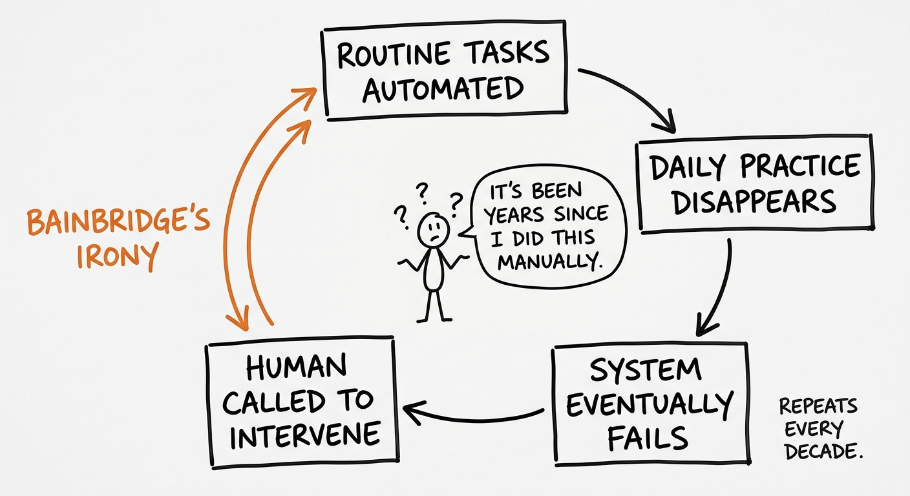

> **TL;DR:** In 1983, Lisanne Bainbridge argued that every significant advance in automation generates conditions for its own oversight failure — skill atrophy, a training paradox, and an opacity problem. These map with uncomfortable precision onto every wave of banking automation since the first ATM. The paper has been cited thousands of times in aviation, medicine, and industrial control. It has not appeared once in US banking supervisory text. As agentic AI intensifies all three ironies simultaneously, the debt banking owes to this literature is coming due.

If you've watched an AML analyst process 400 alerts in a shift, you've seen Bainbridge's argument in its fully developed form. The analyst isn't making decisions anymore. They're maintaining the appearance of a human in a loop that stopped being supervised somewhere around alert 180.

Lisanne Bainbridge named this dynamic in 1983, and named it precisely: not as individual failure, but as the predictable structural consequence of automation that leaves humans responsible for what it cannot handle.[^1] "Ironies of Automation" is six pages in *Automatica*, among the most-cited works in human factors research. In full-text searches of US banking supervisory documents — SR letters, OCC bulletins, FDIC FILs, CFPB circulars, and FINRA regulatory notices spanning more than two decades — neither Bainbridge's name nor any of her paper's core concepts appears.[^8]

This series, Bainbridge's Debt, is about that gap and what it costs.

## What Bainbridge actually argued

*The Bainbridge irony cycle applied to banking: each wave of automation — ATMs, credit scoring, RPA, agentic AI — removes the routine practice that builds the exception-handling skill it then depends on.*

The paper is not a critique of automation. Bainbridge frames the argument carefully: these are structural properties of automated systems, predictable consequences rather than correctable design flaws.

Her first irony, skill atrophy, gets repeated most often and understood least accurately. The claim is not that automation degrades skills through general disuse. It is that automation specifically removes the routine practice that maintains the skill needed for exceptional cases, while leaving humans responsible for exactly those exceptional cases. Bainbridge puts it precisely: as control systems advance, the operator's contribution grows more important. The more you automate the ordinary, the more you depend on human judgment for the extraordinary, and the less ready that judgment is when called.

Her second irony, the training paradox, follows directly. Because manual intervention is needed only in unusual situations, operators need more skill than their manual-era predecessors. But because unusual situations are rare, it is harder to maintain that skill through practice. You cannot rehearse exception-handling at scale; that's what the automation is there to prevent. (The macro-level version of this dynamic — automation reducing the stock of human expertise as a learning externality — is formalized in the [knowledge collapse economics post](post.html?slug=knowledge-collapse-economics).)

The third irony is less often cited and more urgent now. Operators cannot meaningfully intervene in a system they do not understand. Bainbridge's original formulation was about industrial control systems where automation obscured a process's internal state from the operator. The LLM opacity problem is a structural intensification of this: a 175-billion-parameter transformer does not have an "internal state" that can be made legible to a human reviewer in any practically useful sense, even with chain-of-thought output.

> [!QUOTE]
> Bainbridge puts it precisely: as control systems advance, the operator's contribution grows more important. The more you automate the ordinary, the more you depend on human judgment for the extraordinary, and the less ready that judgment is when called.

All three ironies describe the same underlying problem: automation creates a human oversight role without designing for the human factors that oversight requires.

## Four waves, same ironies

Banking has run this experiment four times since 1974. Each wave arrived with new technology and produced, within a decade, the same failure modes.

| Wave | Skill Atrophy | Training Paradox | Transparency Irony |
|---|---|---|---|
| **ATM** (1969–1985) | Tellers repositioned to exception work they weren't trained for | Daily transaction practice replaced by advisory role requiring exactly the judgment it no longer rehearsed | Minimal — process states remained legible to trained operators |
| **Credit Scoring** (1985–1998) | Credit officers stop forming applicant intuitions; the score dominates | Rubber-stamping removes the case-by-case practice that built judgment | Model internals opaque; "black box" is the period's term of art |
| **RPA** (2000–2018) | Analysts inherit the hard 20% of exceptions, without daily practice on the easy 80% | Exception skill requires breadth of task knowledge the automation has eliminated | Bot configurations undocumented; successors inherit queues without understanding the logic |
| **Agentic AI** (2024–present) | Volume and velocity make exhaustive review structurally infeasible | Few have developed the skills needed to intervene in a misbehaving pipeline | Chain-of-thought traces are not decision provenance; transformer internals have no legible state |

### The ATM era (1969–1985)

The first widely adopted US ATM, "Tillie the All-Time Teller," was introduced by First National Bank of Atlanta on May 15, 1974 with a deliberately anthropomorphic design: a smiling mascot, a name, and a recorded voice.[^2] The anthropomorphism was not an aesthetic choice. Customer trust in machine-mediated cash withdrawal was the binding constraint, and the banks responded not by simplifying the interface but by simulating human presence. That functions as a human-factors intervention: the system cannot yet be trusted on its own terms, so it borrows the credibility of human relationship.

What followed was the first banking instance of Bainbridge's skill-atrophy irony. As ATMs took over routine cash handling, bank tellers were repositioned toward sales and exception handling — work they had not been trained for. The daily practice that built teller judgment about customer transactions was replaced by a role that required judgment precisely in the cases automation could not handle. This happened before Bainbridge's paper was published.

### Credit scoring (1985–1998)

FICO's commercial release in 1989 moved the locus of human judgment from individual transactions to model design and exception handling. Credit officers stopped forming intuitions about applicants because the score dominated the decision. By the late 1990s, the HCI literature had a term for what was happening: the human role had drifted to rubber-stamping the algorithm.

A 1999 aviation study by Skitka and colleagues established the empirical baseline for what this drift looks like. Participants with a "very but not perfectly reliable automated aid" underperformed participants with no aid at all, committing both commission errors (acting on wrong recommendations) and omission errors (missing events the aid didn't flag).[^3] The mechanism that banking assumed would catch model errors was, in controlled experimental conditions, making outcomes worse than no model at all.

### RPA (2000–2018)

Robotic process automation (software that replicates human interactions with existing applications to handle rules-based back-office tasks) came to banking without human-factors input.[^7] Human-in-the-loop was an afterthought: exception queues built by RPA engineers with no human-factors involvement. Operations analysts were left with the hard 20% of cases — but without the daily practice on the easy 80% that built their pattern-recognition skill. The knowledge-transfer failure compounds across employee generations: a Fortune 500 stakeholder interviewed a decade into their RPA deployment described it plainly — "bots are often done by some eager person who wants to automate their daily tasks. That person changes the department. Their successor may know more or less what the bot is doing, but the second successor often doesn't have a clue."[^7] Bainbridge's training paradox, documented in real time.

### Agentic AI (2024–present)

All three ironies arrive simultaneously and in more severe form. Skill atrophy accelerates because the volume and velocity of agentic outputs make exhaustive review structurally infeasible. The training paradox intensifies because the skills needed to intervene in a misbehaving agentic pipeline are skills few have developed, because the systems are new. And Bainbridge's transparency irony is now structural rather than incidental: chain-of-thought traces are not decision provenance, and the CFPB's concept of "reason-code laundering" is precisely Bainbridge's third irony applied to LLM output.[^4]

## What makes the fourth wave different

Each of the first three waves produced the same ironies with a decade of lag before the failure became visible. ATM staffing consequences played out through the late 1970s. Credit-officer deskilling was documented in the early 1990s. The RPA exception-handling problem was recognized by the mid-2010s.

The agentic wave has no decade of lag — deployment velocity has outrun institutional learning cycles. Agentic AI reached enterprise deployment in under two years; the governance frameworks explicitly exclude it — SR 26-2 footnote 3 carves out generative and agentic AI entirely[^5] — and the human-factors problems Bainbridge identified are present from the moment of deployment.

What Bainbridge's three ironies predict, in operational terms: declining operator override rates as a skill-atrophy signal; training programs unable to field-test exception handling as the paradox in active form; and governance artifacts that substitute chain-of-thought traces for decision provenance as Bainbridge's third irony under a new label. Each is measurable. None is currently required.

[The next post in this series](post.html?slug=automation-bias-banking) takes up that evidence directly.

The [hitl-vocabulary post](post.html?slug=hitl-vocabulary) covers the six-term governance vocabulary that banking uses in place of HCI language and maps it against what regulators actually say. The [hitl-design post](post.html?slug=hitl-design) addresses checkpoint design under these constraints. This series is the upstream argument: what the HCI research established before the governance vocabulary existed, and why that sequence matters.

## What Bainbridge also proposed

She didn't only name the ironies. Section 2 of the same paper offers three prescriptions that banking has largely not implemented in the forty-three years since.

The first is periodic manual engagement. "One possibility is to allow the operator to use hands-on control for a short period in each shift." Where that's infeasible, high-fidelity simulation is the necessary substitute — not classroom instruction, which Bainbridge explicitly dismisses as insufficient to build knowledge retrievable under pressure. In banking terms, this means structured override drills against real historical failure cases — the kind of practice that annual policy attestations cannot substitute for.

The second concerns what training should actually develop. Unknown failures cannot be simulated, so the goal is adaptive reasoning — the capacity to respond when procedures run out. Her exact language: "it is ironic to train operators in following instructions and then put them in the system to provide intelligence." Most bank AI governance produces exactly this outcome.

The third sits upstream of training entirely: automatic systems should fail obviously rather than degrade gracefully. An LLM that confidently hallucinates while appearing to reason is the structural inverse of this.

> [!QUOTE]
> Perhaps the final irony is that it is the most successful automated systems, with rare need for manual intervention, which may need the greatest investment in human operator training.
> — Lisanne Bainbridge, *Ironies of Automation* (1983)

## The irony that Bainbridge didn't quite name

The automation designers Bainbridge was writing about assumed that if the automation failed, a human could take over. That assumption was wrong in 1983, when it was about industrial control rooms with readable gauges and trained operators. It is more wrong now, when the automation is a stochastic system whose intermediate states cannot be inspected, operating at machine speed, inside organizations whose model risk frameworks were designed for linear regressions.

"Effective challenge," the human oversight control SR 26-2 requires for models within its scope, was designed for systems that can be examined. SR 26-2 explicitly excludes generative and agentic AI from that framework, [leaving the governance question open](post.html?slug=effective-challenge). Four decades of HCI research have documented what happens when you ask humans to supervise systems they cannot inspect, at speeds they cannot match, in domains where their skills have atrophied from disuse. The economic structure that explains why routine tasks are the first to be automated — and what that sequencing does to the binding constraints that limit institutional performance — is developed in [Automating the Wrong Links](post.html?slug=weak-links-banking).

The paper is six pages. It was published in 1983. That's the debt.[^6]

[^1]: Lisanne Bainbridge, "Ironies of Automation," *Automatica* 19(6), 775–779 (1983), [ScienceDirect](https://www.sciencedirect.com/science/article/abs/pii/0005109883900468). The paper was originally presented at the IFAC/IFIP/IFORS/IEA Conference, Baden-Baden, September 1982. Google Scholar recorded [3,553 citations](https://scholar.google.com/scholar?cites=4224537044394939480&as_sdt=5,34&sciodt=0,34&hl=en) as of May 24, 2026.

[^2]: "Tillie the All-Time Teller," Wikipedia, [en.wikipedia.org/wiki/Tillie_the_All-Time_Teller](https://en.wikipedia.org/wiki/Tillie_the_All-Time_Teller); Wells Fargo Corporate Archives, "Dispensing Money Like Magic," [history.wf.com](https://history.wf.com/dispensing-money-like-magic/). The voice of Tillie was later identified as Susan Bennett, who also voiced Apple's Siri. The anthropomorphism was industry-wide: Third National Bank ran a competing campaign for "Tammy the Timeless Teller," complete with a jingle and a woman portraying Tammy — [preserved on YouTube](https://www.youtube.com/watch?v=uNGr4bydMcc).

[^3]: Linda J. Skitka, Kathleen L. Mosier & Mark Burdick, "Does Automation Bias Decision-Making?," *Int'l J. Human-Computer Studies* 51(5), 991–1006 (1999), [ScienceDirect](https://www.sciencedirect.com/science/article/abs/pii/S1071581999902525). The finding that participants underperformed the no-aid condition is the result most challenging to "the analyst will catch it" governance assumption.

[^4]: CFPB's "reason-code laundering" framing is articulated in their Innovation Spotlight on adverse action notices, [consumerfinance.gov](https://web.archive.org/web/20260509192544/https://www.consumerfinance.gov/about-us/blog/innovation-spotlight-providing-adverse-action-notices-when-using-ai-ml-models/) via Wayback Machine as this 2020 post has recently been removed. Chain-of-thought traces that reproduce plausible but non-reproducible reasoning satisfy neither the transparency requirement Bainbridge identified nor the adverse-action accuracy requirement the CFPB established.

[^5]: SR 26-2 (April 17, 2026), footnote 3: "Generative AI and agentic AI models are novel and rapidly evolving. As such, they are not within the scope of this guidance." Full text: [Federal Reserve SR2602a1.pdf](https://www.federalreserve.gov/supervisionreg/srletters/SR2602a1.pdf). For the full SR 26-2 context, see [SR 11-7 at Fifteen](post.html?slug=sr11-7).

[^6]: The series continues in [The Levels We Don't Measure](post.html?slug=automation-bias-banking), which takes up the Sheridan-Verplank framework and the automation-bias research that Bainbridge's theoretical work prefigured.

[^7]: Marc Eulerich, Nathan Waddoups, Martin Wagener, and David A. Wood, "The Dark Side of Robotic Process Automation," *Accounting Horizons* 38(2), 143–152 (2024), [DOI: 10.2308/HORIZONS-2022-019](https://doi.org/10.2308/HORIZONS-2022-019). Interviews with 26 stakeholders at a Fortune 500 firm identified five governance failures; problem 5 (loss of domain knowledge as bots absorb tasks humans no longer perform) is Bainbridge's training paradox documented a decade after deployment. The generational knowledge-transfer quote is attributed to interviewee P-13.

[^8]: Verified through site-restricted full-text searches of federalreserve.gov, occ.gov, fdic.gov, consumerfinance.gov, and finra.org for "Lisanne Bainbridge," "ironies of automation," "automation complacency," "out-of-the-loop syndrome," and "skill degradation from automation." Zero references found in any formal supervisory guidance — SR letters, OCC bulletins, FDIC FILs, CFPB circulars, or FINRA regulatory notices — across the full reviewed corpus, including SR 11-7 (2011), OCC Bulletin 2011-12, FDIC FIL-22-2017, the OCC's 2021 Model Risk Management Comptroller's Handbook, and SR 26-2 (2026). The related concepts ("automation complacency," "skill degradation from automation," "out-of-the-loop syndrome") are likewise absent. Notably, the phrase "human-in-the-loop" itself first enters US financial-regulator-issued guidance only in FINRA's December 2025 Annual Regulatory Oversight Report — 42 years after Bainbridge described the problem it names — where it appears without definition or attribution. Caveat: site-restricted search engines do not index every PDF perfectly, and image-rendered text in older scanned documents may evade full-text search; the finding is high-confidence but not absolute for speeches and working papers.
