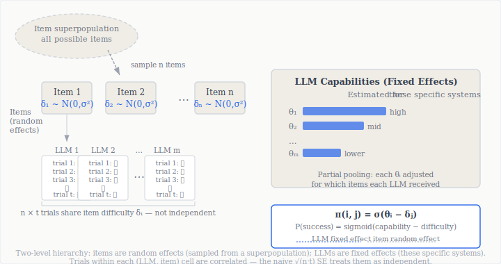

> **TL;DR:** When you run multiple trials per benchmark item (the methodologically correct thing to do), the standard error formula most practitioners use produces confidence intervals that are wrong in opposite directions depending on which accuracy you're estimating. NIST AI 800-3 (February 2026) formalizes the problem: two distinct accuracy notions (*benchmark* vs. *generalized*) that require different estimators, a regression-free correction for the naive formula, and a generalized linear mixed model (GLMM) that tightens those intervals through partial pooling across the evaluation pool. The banking implication is specific: every model validation report presenting a benchmark score with a standard error should state which accuracy is being estimated and which formula produced the uncertainty bound. Most don't, and neither formula is the one they're currently using.

---

The number on the leaderboard says 75.3%. The ±1.2% below it implies the model is meaningfully better than the one at 73.1%. Both figures get copied into the validation documentation and the deployment decision proceeds.

Here's the question worth sitting with: how was that ±1.2% computed? Almost certainly by taking the standard deviation across all individual item-trial results and dividing by the square root of the total observation count. That's the wrong formula, and it was wrong the moment you ran more than one trial per item, which you did, because running multiple trials is the methodologically correct thing to do.

The error compounds depending on what you're actually trying to measure. Most practitioners don't know they're choosing between two different accuracy estimands that have different formulas, different standard errors, and different implications for what the number means. [NIST AI 800-3](https://doi.org/10.6028/NIST.AI.800-3) (February 2026) formalizes both the problem and the fix.[^1]

## Two Accuracy Notions That Aren't the Same Thing

The [NIST 800-2 post](post.html?slug=nist-benchmark-evals) covered Stage 1 of the benchmark evaluation framework : how to define what you're trying to measure before you run a single eval. This post operates one level lower, at the math that converts observed outcomes into reported numbers. Even with a well-designed evaluation and a valid construct, you can still report the wrong statistic.

NIST 800-3 formalizes a distinction that most benchmark reporting collapses: *benchmark accuracy* and *generalized accuracy* are related but different quantities.

**Benchmark accuracy** is conditional on the specific items drawn into the benchmark. It answers: how well did this model perform on *these 198 questions*? The uncertainty here reflects only LLM nondeterminism: the randomness from sampling at generation time. It's the right estimand when the question is whether a specific validation run produced a passing score.

**Generalized accuracy** asks the harder question: how well would this model perform on the full *superpopulation* of items the benchmark represents? The uncertainty here includes both LLM nondeterminism *and* the variance from having drawn a finite sample of items from a larger domain. It's what you actually care about when deciding whether to deploy — you're not deploying to answer GPQA-Diamond questions specifically, you're deploying to handle the domain those questions represent.

The biology exam analogy the paper uses is cleaner than any technical definition: benchmark accuracy is your average score on *this exam* given infinite reattempts; generalized accuracy is your average score on *all biology questions that could have been on the exam* given infinite reattempts. Neither is your single observed score. Both are defined in expectation.

The practical consequence: generalized accuracy CIs are always wider than benchmark accuracy CIs, because they carry the additional uncertainty of item selection. NIST's evaluation of 22 frontier LLMs on GPQA-Diamond (198 items, 8 trials per item) found that some apparent model gaps disappear under generalized accuracy — Llama 3 (40B) and Phi 4, for example, are distinguishable at the 95% level under benchmark accuracy but not under generalized accuracy. The benchmark discriminated them; the domain doesn't. That distinction matters when the validation artifact is supposed to support claims about production performance generally, where the benchmark items are a sample rather than the target.

## Why Multiple Trials Break the Naive Standard Error

Here is the structural problem. A standard evaluation run produces $n \times t$ binary observations: $n$ items, each attempted $t$ times. The formula most teams report:

$$\text{SE}_{\text{naive}} = \frac{\hat{\sigma}}{\sqrt{n \cdot t}}$$

treats all $n \times t$ observations as independent draws from a common distribution. They are not. Trials on the same item share a common item difficulty: they are *clustered*. Running the same model on the same question eight times is not equivalent to running it on eight different questions once.

The consequence depends on which accuracy you're estimating, and the direction of the error is opposite for the two cases:

- For **benchmark accuracy**: the naive formula is *under-confident* (CIs are too wide). It double-counts item-level variation as if each trial introduced independent item variance.
- For **generalized accuracy**: the naive formula is *overconfident* (CIs are too narrow). It ignores the item-selection variance that generalized accuracy is supposed to quantify.

The correct regression-free estimators require using the item average as the fundamental unit of analysis. Let $\bar{z}_{i,j} = \frac{1}{t}\sum_k y_{i,j,k}$ denote the average score for LLM $i$ on item $j$ across $t$ trials.

The correct SE for **benchmark accuracy** accounts for within-item binomial variance:

$$\text{SE}_{\text{BA}} = \sqrt{\sum_{j=1}^{n} \frac{\bar{z}_{i,j}(1-\bar{z}_{i,j})}{n^2(t-1)}}$$

For **generalized accuracy**, treating item-level averages as independent draws gives the standard CLT SE:

$$\text{SE}_{\text{GA}} = \frac{\widehat{\text{std}}(\bar{z}_{i,\cdot})}{\sqrt{n}}$$

Standard error formulas: notation and derivation

The key objects in a multi-trial benchmark evaluation:

<ul>
<li>\(y_{i,j,k} \in \{0,1\}\) — success (1) or failure (0) for LLM \(i\) on item \(j\), trial \(k\)</li>
<li>\(\bar{z}_{i,j} = \frac{1}{t}\sum_{k=1}^t y_{i,j,k}\) — per-item mean score for LLM \(i\) on item \(j\)</li>
<li>\(n\) — number of items; \(t\) — trials per item; \(m\) — number of LLMs</li>
</ul>

<strong>Point estimate (both accuracy types):</strong>

\[\hat{\mu}_{i} = \frac{1}{n}\sum_{j=1}^n \bar{z}_{i,j}\]

<strong>SE (benchmark accuracy) — accounts for within-item binomial variance:</strong>

\[\text{SE}_{\text{BA}} = \sqrt{\sum_{j=1}^{n} \frac{\bar{z}_{i,j}(1-\bar{z}_{i,j})}{n^2(t-1)}}\]

<strong>SE (generalized accuracy) — treats items as i.i.d. draws from a superpopulation:</strong>

\[\text{SE}_{\text{GA}} = \frac{\widehat{\text{std}}(\bar{z}_{i,\cdot})}{\sqrt{n}}\]

The naive formula \(\hat{\sigma}/\sqrt{nt}\) is asymptotically correct for benchmark accuracy only when \(t = 1\). For \(t > 1\), it treats correlated trials as independent and is invalid for both estimands. Specifically: for benchmark accuracy, the naive denominator \(\sqrt{nt}\) is larger than the correct one (making CIs too narrow, i.e., <em>under-confident</em>); for generalized accuracy, the naive formula misses the item-selection component entirely (making CIs too wide, i.e., <em>overconfident</em>).

<strong>Note on the benchmark accuracy formula:</strong> The expression \(\frac{\bar{z}_{i,j}(1-\bar{z}_{i,j})}{t-1}\) is the sample variance of Bernoulli outcomes within item \(j\). Summing across items and dividing by \(n^2\) gives the variance of the grand mean — the standard propagation-of-uncertainty result for a mean of means.

The naive formula's denominator is $\sqrt{nt}$, which makes it appear more precise than either correct formula. Specifically for generalized accuracy — the operationally relevant estimand for deployment decisions — the naive formula understates uncertainty. The model comparison you made based on overlapping ±1.2% bands may not have been a comparison at all.

## The GLMM: A Principled Statistical Model

The regression-free formulas above are the correction for teams that cannot change their analysis infrastructure. The fuller solution is to impose an explicit statistical model on the evaluation data, one that parameterizes both LLM capability and item difficulty directly.

NIST 800-3 formalizes a **generalized linear mixed model (GLMM)** for benchmark evaluation[^8]:

The GLMM specification

The complete model:

\[Y_{i,j,k} \sim \text{Bernoulli}(\pi_{i,j})\]
\[\pi_{i,j} = \sigma(\theta_i - \delta_j)\]
\[\delta_j \sim \mathcal{N}(0, \sigma^2)\]

Parameter interpretation:

<ul>
<li>\(\theta_i\) — <strong>fixed effect: LLM capability</strong>. The scalar latent capability of LLM \(i\), estimated as a fixed effect because we want inference about <em>these specific named systems</em>, not generalization to a population of possible models.</li>
<li>\(\delta_j\) — <strong>random effect: item difficulty</strong>. Drawn from \(\mathcal{N}(0, \sigma^2)\), so the average item has difficulty 0. Modeled as a random effect because items are treated as a sample from a superpopulation. This is the hierarchy.</li>
<li>\(\sigma(\cdot)\) — the sigmoid function: \(\sigma(x) = 1/(1+e^{-x})\)</li>
<li>\(\sigma^2\) — the variance of item difficulties across the superpopulation. Estimated from data.</li>
</ul>

<strong>Key interpretive property:</strong> An LLM with capability \(\theta_i = \delta_j\) has 50% probability of correctly completing item \(j\). The scale is symmetric: \(\sigma(7-5) = \sigma(3-1) \approx 88\%\) — success probability depends on the gap between capability and difficulty; the absolute values of \(\theta_i\) and \(\delta_j\) don't enter separately.

<strong>IRT connection:</strong> This is the Rasch model (1-parameter logistic / 1PL), with one key inversion relative to classical IRT. Standard IRT models test-takers as random effects (drawn from a population of examinees) and items as fixed. Here the roles are reversed: LLMs are fixed effects (we want estimates for these named systems); items are random effects (they're a sample from a domain). This inversion is the correct adaptation for the LLM evaluation context, where the goal is inference about specific commercial systems.

<strong>vs. the 3PL from the <a href="post.html?slug=metrics-metrics-metrics">metrics post</a>:</strong> The 3PL adds discrimination (\(a_j\): how sharply an item separates high- and low-capability models) and guessing floor (\(c_j\): lower asymptote, used as a hallucination proxy). The Rasch/1PL assumes uniform discrimination and no guessing floor. The tradeoff is sample efficiency: the 3PL requires enough data per item to estimate three parameters reliably; the 1PL is stable with smaller benchmarks and more items. For uncertainty quantification across many models and items, the Rasch formulation NIST adopts is the right choice. For per-item diagnostic decomposition — specifically surfacing which items are dominated by pattern-matching — the 3PL remains the right tool.

The key mechanism is partial pooling: each LLM's capability estimate borrows information from how all other LLMs performed on the same items. If an item is consistently hard across all 22 models in the evaluation, the model learns a large $\delta_j$ and adjusts every LLM's $\hat{\theta}_i$ accordingly. In plain terms: a model at 70% on an unusually hard item set is treated differently from one at 70% on easy items. The naive average treats both as identical; the GLMM doesn't.

The result: GLMM confidence intervals are narrower than regression-free CIs on the same data, without sacrificing coverage accuracy. In that evaluation (198 items, 8 trials, 22 LLMs), GLMM CIs were narrower for most model estimates, by approximately 0.013 on average. That is a meaningful reduction when frontier model differences cluster in the 3–8% range and the discrimination question is whether two models are actually distinguishable.

## Simulation Results: When the Estimators Agree and When They Diverge

The paper's simulation section is where the practical stakes become clear. Three data-generating settings, each testing a different assumption about the structure of benchmark data.

In Setting A (well-specified), the true data-generating process is logistic, matching the GLMM's assumed functional form. Both methods achieve close to target 95% coverage. The GLMM produces narrower CIs (smaller by ~0.013 on average for 40 items / 8 trials) at equal RMSE. This is the scenario where the modeling assumptions are correct and tighter uncertainty is the payoff.

In Setting B (linear), success probability is a linear combination of capability and difficulty, not logistic. The GLMM's functional form assumption is violated, yet coverage stays near target. The logistic vs. linear distinction matters less than expected at moderate accuracy levels (50–80%), where the two functions are close on the probability scale. Partial pooling still helps.

In Setting C (no structure), success probabilities are drawn i.i.d. from a uniform distribution with no latent capability or item difficulty. GLMM coverage degrades into the 80–90% range for many conditions. The regression-free approach maintains near-target coverage across all three.

| Setting | Data-generating process | GLMM coverage | Regression-free coverage | GLMM CI width |
|---|---|---|---|---|
| A — well-specified | Logistic (matches GLMM) | ~95% | ~95% | Narrower (~0.013 avg) |
| B — linear | Linear combination | ~95% | ~95% | Similar to regression-free |
| C — no structure | i.i.d. uniform | 80–90% | ~95% | Narrower (coverage degraded) |

The practical takeaway is not "use regression-free because it holds up in Setting C." It is that the GLMM's additional assumptions are checkable; checking them is informative. The GLMM provides model fit diagnostics (AIC, BIC, DHARMa residual plots, convergence signals) that regression-free approaches cannot produce. A GLMM that fits poorly is telling you something about the benchmark; a regression-free estimator fails silently under the same conditions.

In the GPQA-Diamond fit, NIST found that the mixed model achieves AIC 33,995 versus 44,378 for the fixed-effects-only alternative, a difference of more than 10,000, confirming that item difficulty variation is real and quantitatively decisive. The structure the GLMM assumes is there. Ignoring it means reporting CIs that are miscalibrated for the exact benchmark most AI comparisons cite.[^2]

The simulation also surfaces a subtler point about benchmark size. GLMM efficiency gains over regression-free are largest on small benchmarks (40–80 items), where partial pooling provides the most lift. For very large benchmarks (400+ items), both methods converge to similar CI widths. For the small, expensive benchmarks that practitioners use to evaluate frontier models on hard tasks (GPQA-Diamond at 198 items, many domain-specific validations at 50–100 items) the GLMM gains matter most.

## What the GLMM Reveals Beyond Better CIs

The GLMM produces two classes of diagnostic statistics that regression-free approaches cannot generate. Both turn out to be useful for purposes beyond uncertainty quantification.

The estimated random effects $\hat{\delta}_j$ give a principled difficulty score for every item, calibrated against the full pool of tested LLMs. Ranking items by average success rate misses this: partial pooling and the logit scale together preserve extreme values that raw percentages compress away.

NIST's BIG-Bench Hard analysis surfaces a concrete case. One "Date Understanding" item has an estimated difficulty of $\hat{\delta} = 7.58$: every tested LLM answered it incorrectly. Extreme positive random effects are a red flag: either the item represents a genuine blind spot across all frontier models, or it is ambiguously worded. On inspection, the item has two defensible answer options. The GLMM flagged it; a simple accuracy table would have silently included it in the aggregate score.[^3]

The GPQA-Diamond domain analysis tells a different story. Chemistry items have a mean random effect of +0.59 compared to −0.37 for Biology and −0.55 for Physics. This holds across the full pool of 22 tested LLMs, making it a structural property of the benchmark domain rather than any individual model's signature. Human-labeled difficulty categories are distributed similarly across the three domains, which rules out annotation imbalance as the explanation. Frontier LLMs, as a class, find Chemistry harder than Physics or Biology on GPQA-Diamond. That's invisible in a single reported accuracy number.

The GLMM also enables variance decomposition of total evaluation variance into two components. The *inter-cluster variance* ($\sigma^2$) quantifies how spread out item difficulties are across the benchmark superpopulation. The *intraclass correlation coefficient* (ICC) measures what fraction of total variance is explained by item identity:[^4]

$$\text{ICC} = \frac{\sigma^2}{\sigma^2 + \sigma_\varepsilon^2}$$

High ICC means items tend to be all-or-nothing across the tested LLMs: either most models get an item right or most get it wrong. Low ICC means results are highly inconsistent within items across trials, suggesting prompt sensitivity or reasoning stochasticity rather than stable item difficulty.

The operational consequence follows directly. *Effective samples per trial* (EST) measures how much independent information each trial contributes:

$$\text{EST} = \frac{1}{1 + (t-1) \cdot \text{ICC}}$$

Effective samples per trial: boundary cases and BIG-Bench Hard examples

Boundary cases:

<ul>
<li>If \(\text{ICC} \to 1\): each model either always gets each item right or always gets it wrong. \(\text{EST} \to \frac{1}{t}\). Five trials contribute the same information as one trial.</li>
<li>If \(\text{ICC} \to 0\): trials are essentially independent. \(\text{EST} \to 1\). Every trial adds new information.</li>
</ul>

<strong>BIG-Bench Hard: Movie Recommendation task</strong> 
\(\sigma^2 = 16\), ICC = 0.83, \(t = 5\) trials. 
\(\text{EST} = \frac{1}{1 + 4 \times 0.83} = \frac{1}{4.32} \approx 0.23\) 
Five trials yield approximately 1.15 effective independent observations. The model either consistently solves or fails each item; retrying adds almost no information. The evaluation budget would be better spent on more unique items.

<strong>BIG-Bench Hard: Web of Lies task</strong> 
\(\sigma^2 = 0.47\), ICC = 0.12, \(t = 5\) trials. 
\(\text{EST} = \frac{1}{1 + 4 \times 0.12} = \frac{1}{1.48} \approx 0.67\) 
Five trials yield approximately 3.4 effective independent observations. Here, running more trials meaningfully reduces variance — items have similar difficulty but variable response behavior. The additional trials are worth the compute cost.

BIG-Bench Hard's Movie Recommendation task has ICC = 0.83 and five trials per item — five trials yielding only about 1.15 effective independent observations. Web of Lies has ICC = 0.12 and yields 3.4 effective observations from the same five trials. Neither pattern correlates with average accuracy. You cannot identify which tasks have wasteful evaluation designs by looking at benchmark scores. But the variance decomposition tells you immediately . It also tells you whether to add items or add trials when you want to reduce uncertainty.[^5]

The Global-MMLU Lite result is worth noting separately: across its language and category subdivisions, ICC is consistently high and EST consistently low, meaning that adding trials per item is nearly always wasteful for this benchmark. For MMLU-style benchmarks, the evaluation budget should prioritize item diversity over additional trials per item.

## The MRM Documentation Question

I've watched the question of what goes into a model validation report for a GenAI deployment get more specific over the past two years. SR 11-7's framework asked for conceptual soundness, ongoing monitoring, and outcomes analysis. For a logistic regression scorecard, those categories translate into a KS statistic, a PSI, and a back-test against holdout data — each carrying an explicit threshold and a derivation the validator could sign off on.

For an LLM deployment, the translation has been ambiguous. NIST 800-3 gives a more specific answer than anything I've seen from a practitioner or regulatory source for LLM evaluation specifically.

> [!IMPORTANT]
> **SR 26-2 and GenAI scope (April 2026):** SR 26-2 explicitly excludes generative AI and agentic AI from formal scope (footnote 3), leaving benchmark evaluation standards for LLM deployments formally unaddressed — while affirming that traditional model risk principles continue to apply to non-generative models. NIST AI 800-3 is not a regulatory requirement. But the NIST AI RMF citation chain has a track record of translating voluntary NIST publications into examination expectations — the 800-2 framework has surfaced in examination-adjacent conversations I've tracked through practitioner networks. AI 800-3's statistical requirements map directly onto Stage 3 (qualified claims) of the 800-2 process, which makes this framing defensible even without a formal mandate.

Three things change in MRM documentation if you apply the 800-3 framework:

First, the score needs an estimand declaration. "75.3% accuracy on GPQA-Diamond" is underspecified. "75.3% generalized accuracy on GPQA-Diamond (n=198, t=8), with 95% CI [73.1%, 77.5%] using the regression-free clustered SE" is a claim an examiner can evaluate. The benchmark vs. generalized distinction isn't semantic hairsplitting — it determines whether the reported CI is valid and what the score claims to predict about production performance.

Second, the SE formula belongs in the validation artifact itself. A report that says "standard error calculated as standard deviation divided by square root of sample size" with $n = 198 \times 8 = 1584$ has applied the wrong formula. NIST 800-3 has now published and simulated the correct ones. I'd argue that after this paper, reporting the naive formula constitutes a documented methodological choice, not an oversight.

Third, the GLMM opens a path to multi-cycle comparability. For teams running champion-challenger validation across model releases, the capability estimates $\hat{\theta}_i$ are on a latent logit scale with meaning independent of the specific items tested. Two models evaluated on benchmarks of different difficulty compositions can have their capabilities compared via $\hat{\theta}$ in a way that raw accuracy scores don't support — analogous in principle to IRT equating in educational testing, where scores are made comparable across test administrations with different item sets — though achieving comparability in practice requires explicit equating procedures (common items or anchor sets), not simply fitting the same Rasch model class to two independent evaluations. This matters specifically for periodic model re-validation cycles, where the benchmark composition may shift between the champion evaluation and the challenger evaluation; teams attempting cross-administration capability comparison should design linking items into their evaluation protocol.

The [effective-challenge post](post.html?slug=effective-challenge) argued that validators need the vocabulary to ask hard questions about GenAI model documentation. "Which accuracy estimand is this CI reporting, and which SE formula produced it?" is now a question with a published answer. The three-stage framework from [NIST 800-2](post.html?slug=nist-benchmark-evals) establishes what evaluation objectives and protocol documentation belong in a validation artifact; 800-3 adds the statistical layer that determines whether the reported numbers are valid given those objectives.

## What the Failing GLMM Tells You

When the GLMM's coverage degrades (as in Setting C, where there's no latent structure), the failure presents as poor fit statistics (high AIC relative to simpler alternatives), failed convergence, or non-Gaussian random effect distributions. The regression-free approach would produce the same point estimate regardless: it fails silently. The GLMM fails loudly.

What GLMM misfit actually signals is a construct validity problem: the benchmark tests multiple distinct capabilities that won't compress to a single $\theta$ dimension, making any single-number summary invalid before the CI is even computed. This maps to the language the [NIST 800-2 framework](post.html?slug=nist-benchmark-evals) uses for Stage 1. The GLMM makes that failure visible before it gets reported in a leaderboard; the naive formula would have produced a number anyway.

This is the connection back to the argument the [metrics post](post.html?slug=metrics-metrics-metrics) made: verification of measurement validity is the work most teams skip. The GLMM makes some of that verification automatic. Fit the model, inspect the diagnostics, let convergence failure flag construct validity problems before they compound into a misleading confidence interval on a model comparison no one should be making.

## Who's Responsible for the Right Error Bar

Every model comparison table I've seen (22 models, their GPQA-Diamond scores, the gap between rank 3 and rank 5) reports the naive formula, implicitly treating all item-trial observations as independent. The ±N% bands are probably too narrow for generalized accuracy and the pairwise comparisons that look significant at the 5% level may not hold under the correct SE.

Both the benchmark design and the evaluation protocol were correct. The failure is in the statistical framing, and that framing has a name now, a published derivation, and a 22-model simulation backing it up.

For teams whose evaluation results feed directly into deployment decisions or model risk documentation, the question is whether to keep reporting the number that's convenient to compute or the number that's correct. NIST 800-3 has formalized which is which.

> [!QUOTE]
> The leaderboards you're reading almost certainly report the wrong one.

The leaderboards you're reading almost certainly report the wrong one.

[^1]: NIST AI 800-3, "Expanding the AI Evaluation Toolbox with Statistical Models," Keller et al. (2026), NIST Center for AI Standards and Innovation. Authors: Keller, Kwegyir-Aggrey, Steed, Rao, Sharp, Bergman. https://doi.org/10.6028/NIST.AI.800-3. The paper evaluates 22 API-access frontier LLMs on three benchmarks: GPQA-Diamond (198 items), BIG-Bench Hard, and Global-MMLU Lite, comparing GLMM and regression-free estimates across both simulated and real data.

[^2]: The goodness-of-fit comparison (Table 4 in the paper): GLMM AIC 33,995 vs. fixed-effects-only model AIC 44,378 on GPQA-Diamond. The fixed-effects-only model is identical to the GLMM but with item random effects removed : it treats all items as equally difficult. The 10,383-point AIC difference reflects the extent to which items vary in difficulty across the 22-LLM pool. Standard model selection practice (where AIC differences above ~10 indicate strong evidence for the more complex model) would treat this as decisive.

[^3]: The ambiguous BIG-Bench Hard item is shown in the paper's Figure 5a: "Jane booked a flight for tomorrow, July 29, 2002. What is the date 24 hours later in MM/DD/YYYY format?" with answer options including both 07/29/2002 and 07/30/2002. The answer key lists 07/29/2002, but 07/30/2002 is also defensible : hence $\hat{\delta} = 7.58$ and 100% failure rate. The paper notes explicitly that extreme random effects can indicate "a truly challenging question, or that the corresponding question is problematic and should be removed from the benchmark." A post-hoc item audit based on random effect estimates would have flagged this before it influenced published benchmark scores.

[^4]: The ICC formula and the Kish (1965) effective sample size calculation are standard tools in survey sampling and multilevel modeling. The connection to educational testing is direct: the ICC for a classroom exam measures how much of the score variation is explained by teacher-level effects; here it measures how much is explained by item-level effects within the tested model pool. McElreath's *Statistical Rethinking* (Chapter 13) is the standard accessible treatment; his multilevel chapter covers why partial pooling outperforms both complete-pooling and no-pooling estimates in hierarchical data. A [course I taught on Bayesian statistics](https://dsba6010-spring2022.netlify.app/content/11-multilevel/) covers this chapter directly.

[^5]: The BIG-Bench Hard variance decomposition finding has a direct practical implication that NIST states explicitly: "for tasks where intra-item variance is larger, increasing trials per item may meaningfully reduce variance of accuracy estimates, while for tasks with larger inter-item variance it is more important to increase the number of unique items." This is a framework for allocating evaluation compute . Most teams answer it by running a fixed number of trials across the board rather than adapting to per-task variance structure. The ICC provides the per-task diagnostic that makes adaptive allocation possible.

[^6]: The regression-free estimators described in Section 3.3 of NIST 800-3 extend Miller (2025), "We need to talk about standard errors in LLM evals," which proposed the correct SE formula for multi-trial evaluations. The NIST contribution is to formalize the benchmark vs. generalized accuracy distinction, derive both SE formulas from first principles, and validate them in simulation against the GLMM. The Miller paper is the practitioner-accessible entry point; 800-3 is the formal treatment.

[^8]: Teams implementing the GLMM can use `lme4` in R (`glmer` with `family = binomial(link = "logit")`) or `pymer4` in Python, which wraps `lme4` via rpy2. The `statsmodels` `MixedLM` class supports random-effects models but requires additional work to fit a logit-link GLMM; `bambi` (Python) or `brms` (R) handle the Bayesian formulation with minimal boilerplate and produce posterior distributions over capability parameters rather than point estimates with delta-method standard errors.

[^7]: For teams choosing between the frequentist GLMM described in this post and a Bayesian multilevel model, the practical difference is primarily in how uncertainty is expressed. Both impose the same hierarchical structure (fixed effects for LLMs, random effects for items). The frequentist GLMM produces maximum likelihood estimates with delta-method standard errors; a Bayesian multilevel model produces posterior distributions over capability parameters, which makes uncertainty about item difficulty variance ($\sigma^2$) explicit rather than treating it as a nuisance parameter. The NIST DeepSeek evaluation referenced in the [NIST 800-2 post](post.html?slug=nist-benchmark-evals) used the frequentist formulation; both approaches answer the same fundamental question.
