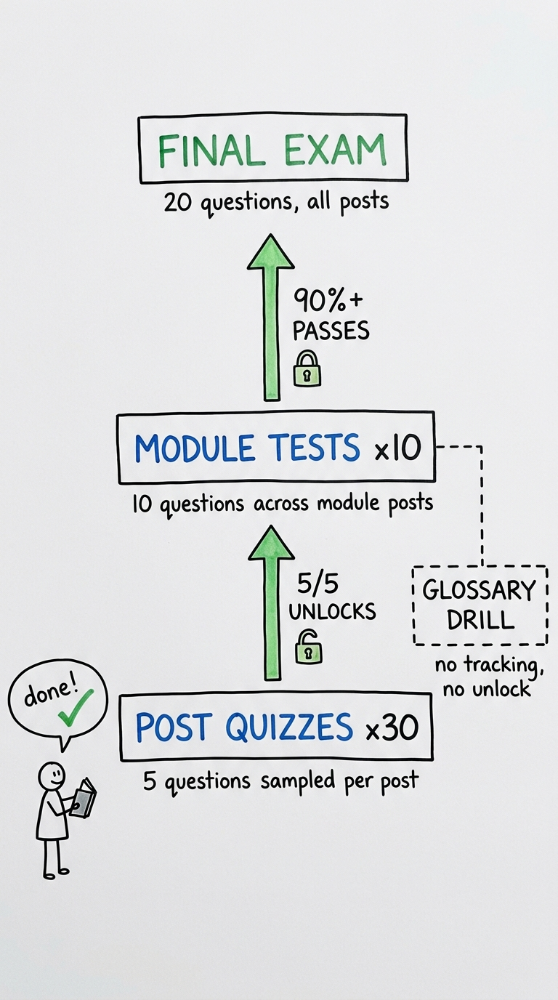

There's a word that keeps surfacing when I try to describe what I'm watching happen in AI right now: drift.

Not the technical kind — though that too. I mean something broader. Models drift from their stated behavior. Codebases drift from the developers who wrote them, as agents take on more of the work. Governance frameworks drift from the systems they were designed to govern. Organizations drift, sometimes gradually and sometimes all at once. And the word itself drifts: used the way "bias" was a decade ago, as shorthand for AI behavior that seems wrong, without the follow-up question that would make it precise.

This blog — called Drift, for reasons that should be obvious by now — is my attempt to document that drift from the edges where it's most visible.

## On the Speed of the Drift

I want to be careful not to be too knowing about all of this. It's easy to fall into a pose of world-weary expertise when you work with these systems every day — to treat the genuinely strange as mundane because you've seen a lot of model outputs. But something real is happening. The models I work with today are qualitatively different from the ones I worked with two years ago, and the ones two years from now will almost certainly be different again in ways I can't predict. That's exciting and disorienting in roughly equal measure.

There's also a certain irony embedded in the name. Drift is starting to be used the way "bias" was a decade ago: a catch-all for AI behavior that seems off, without specifying what it's drifting from or measured against what baseline. Engineers invoke drift detection as a risk-management ritual without specifying the reference distribution, the detection threshold, or the failure mode they're worried about. The word sounds quantifiable and scientific in a way "bias" never did — but the epistemological problem is the same either way: an absent normative baseline. What you're actually looking for depends entirely on the system, the institution, and the specific failure mode you're trying to prevent.

## From Notes to a Course

I've kept private notes for years. The problem with private notes is that they don't push back — you can handwave past the parts you don't fully understand, leave a vague bullet point, promise yourself you'll come back to it. Writing for an audience forces a different kind of honesty: you have to say the thing, or admit you can't. I'm also motivated by a quiet frustration with how GenAI gets discussed publicly. The coverage tends to oscillate between breathless hype and breathless doom, with very little in the messy, technically real middle where the actual work happens. I'd like to contribute something from that middle.

When I started, I said I'd write about four things. That number didn't survive contact with the subject. What began as scattered notes has turned into something with a shape: ten series, around thirty posts, each series roughly a lecture's worth of argument. Somewhere along the way it stopped being a blog I was adding to and started being a curriculum I was, apparently, writing.

So I'm going to call it what it is: an opinionated course on the risk of GenAI and agentic systems in banking. Opinionated because I'm not pretending to neutrality — I have views about what's overbuilt, what's underbuilt, and where the governance is theater. A course because the pieces build on each other in an order, even if you can read them in any order you like.

The arc runs roughly like this. It starts with [the governance baseline](post.html?slug=sr11-7) — the fifteen-year-old model risk framework banks are stretching over systems it was never written for — and where it cracks. Then how agents are [actually built](post.html?slug=context), and what happens when they [start calling each other](post.html?slug=a2a-risks) or [driving a screen](post.html?slug=molmoweb-data-flywheel). Then the hard part: whether you can [measure](post.html?slug=metrics-metrics-metrics) any of it, whether you can [break it](post.html?slug=adversarial-workflow) before someone else does, and what [keeping a human in the loop](post.html?slug=hitl-design) actually buys you — a question the [human-factors literature](post.html?slug=bainbridge-ironies) answered, in part, decades ago. It ends where the stakes are most concrete: [who owns liability when an agent moves money](post.html?slug=payments-liability-gap), and the [economics](post.html?slug=ai-econ-model) of adopting all of it.

Here's what each module is designed to let you do:

| # | Module | After this module, you can… |
|---|--------|------------------------------|
| 1 | Regulatory Drift (SR 11-7, effective challenge) | Explain why 15-year-old MRM guidance both holds and breaks for GenAI |
| 2 | Agentic Engineering (context, agent design, skills) | Describe how a production agent is actually built and where it goes off the rails |
| 3 | Agent to Agent (A2A, risks, cases) | Identify the new attack surface when agents call agents |
| 4 | GUI Agents (data flywheel, openness, verifier) | Reason about training data and verification for computer-use agents |
| 5 | The Eval Gap (metrics, NIST, uncertainty) | Tell a real capability measurement from a leaderboard artifact |
| 6 | Adversarial Testing (workflow, gates, incompleteness) | Design a deployment gate and accept that red-teaming never finishes |
| 7 | Human and the Loop (guardrails, HITL vocab/design) | Distinguish "is HITL present" from "is HITL effective" |
| 8 | Bainbridge's Debt (ironies, automation bias, HCI) | Name the human-factors failures automation keeps re-incurring |
| 9 | Banking AI (payments, identity, commerce) | Locate the liability gap when an agent moves money |
| 10 | Economics of AI (econ model, FTP, knowledge collapse) | Reason about what economic forces drive and constrain AI adoption |

I built it so it can be taught more than one way — a ten-week lunch-and-learn, a semester, or read at your own pace. Each series stands on its own; together they're the course.

If you work in model risk or AI governance, I hope the technical posts are readable. If you're an ML engineer, I hope the governance posts don't feel like compliance theater. I'm trying to write for both — which may mean occasionally failing both.

Posts will vary in length and formality. Some are close to polished essays. Others are working notes — me thinking through a problem in real time, with no guarantee I've resolved it by the end. That's true of the course, too: it documents a moving target, which means part of its job is to keep going stale and getting rewritten.

If that sounds useful to you, I'm glad you're here.

## How the Quizzes Work

The course has a three-tier quiz system:

- **Post quizzes** — Every post with a question pool shows a _// check your understanding_ section at the bottom. Five questions are drawn at random from a larger pool, with options randomized each time — retaking gives a genuinely different pass through the material, not a memory test for answer positions. Every answer (right or wrong) shows an explanation; the explanation for a wrong answer is worth as much as getting it right.
- **Module tests** — Accessible from the [course landing page](index.html). Ten questions from across all posts in the module. Unlocks only after you've scored 5/5 on every post quiz in that module (the ✓ badge on each post confirms it). A score of 90%+ counts as a pass.
- **Final exam** — Twenty questions from across the entire course. Unlocks after passing all ten module tests. Also requires 90%+.
- **Glossary drill** — A separate study tool on the [glossary page](../glossary.html). Click _// drill mode_ to practice term recall from definition — fill-in-the-blank, no multiple-choice options. No score requirement; respects whatever domain filter you've set, so you can drill only regulatory terms or only evals terms before a module test.

Progress is saved in your browser's local storage — it won't carry over across browsers or private windows. No account system, by design.

The quizzes test the argument each post makes (why something is true, what a framework implies, where a concept breaks down) rather than trivia. If you find a question that seems to test the wrong thing, the [GitHub repo](https://github.com/wesslen/wesslen.github.io) is the right place to flag it.

## What I Actually Do

My day-to-day involves building and evaluating language models, thinking about the organizational infrastructure for governing them, and working out what it means to design agents that are reliable enough to trust with real decisions. A lot of it is less glamorous than the demos suggest, and it sits at an uncomfortable intersection between technical engineering and institutional risk management that neither field has fully claimed.

The drift shows up here too. A question I keep running into is how you apply fifteen-year-old governance frameworks to AI systems that barely existed five years ago. In financial services, banks are actively trying to apply [model risk guidance written for linear regression models](post.html?slug=sr11-7) to large language models making underwriting recommendations. The question is not rhetorical. The technical and organizational problems are both real, and they compound each other in ways that don't get discussed much outside of narrow specialist audiences.

That edge — between what the frameworks cover and what the systems actually do — is what I want to write about. The people who understand the engineering often don't spend much time in governance conversations, and vice versa. I'm interested in what happens when you try to hold both at once.
