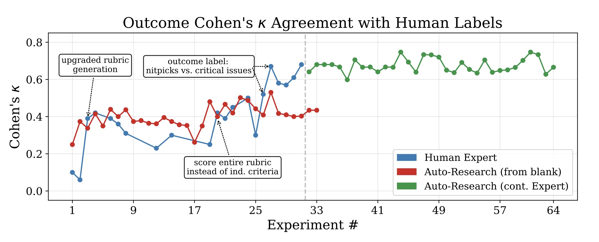

> **TL;DR:** The verifiers behind GUI agent benchmarks systematically overcount success — WebVoyager's native evaluator credits 74.6% of tasks as successful on one benchmark where the Universal Verifier calls only 37.9%. The fix is architectural: four design principles around rubric quality, process/outcome separation, controlled failure diagnosis, and divide-and-conquer screenshot context management. The most deployable insight is the process/outcome split, which distinguishes "the agent executed correctly" from "the user's goal was achieved" — a governance distinction that enterprise deployments haven't had a framework for. An AI auto-research agent reached 70% of expert verifier quality in a single day versus the expert's three weeks, but stalled when it came to the structural design decisions that drove the largest gains.

Part 3 of the GUI Agents series. [Part 1](post.html?slug=molmoweb-data-flywheel) found that synthetic training trajectories outperform human annotations because the synthetic teacher had structured access to page semantics that the trained agent won't have at runtime. [Part 2](post.html?slug=molmoweb-openness-gap) examined the gap between open-release framing and what the public repository actually provides. This post moves to the measurement layer above both: if the judge scoring agent performance is wrong in a consistent direction, everything downstream is wrong with it — relative comparisons between agents may still be informative, but absolute success-rate claims are not.

Every GUI agent paper ends with a number. A percentage on WebVoyager, a score on Mind2Web, a position on a leaderboard. Those numbers have driven the field: which architectures to pursue, which benchmarks to consider solved. Microsoft Research's Universal Verifier paper asks a question the field has mostly skipped — how do you know the scoreboard is right?[^1]

The answer, based on the data in that paper, is that the canonical verifiers behind those scoreboards have been systematically wrong in one direction. Not in a noisy-labels way. In a structurally-overcounting-success way.

## The scoreboard problem

The WebVoyager benchmark ships with a GPT-4V evaluator the original paper validated at 85% human agreement on 300 tasks.[^2] At that sample size, κ=0.70, it probably is trustworthy. The problem is what happens when that evaluator is deployed at scale as ground truth for training the next generation of agents.

The Universal Verifier (UV) rescores three benchmarks (WebVoyager, Online-Mind2Web, and WebTailBench) across two agent models, treating UV labels as the reference. On WebVoyager with the Fara-7B agent, the native verifier calls 74.6% of tasks successful. The Universal Verifier calls 37.9%. The false positive rate is 60%: tasks the native verifier credits as success when UV marks them as failure.[^3]

> [!QUOTE]
> The field spent two years building better agents. This paper suggests it should have also been building better judges.

A 60-point false positive rate is the basis on which the field has been comparing models, training new agents on those "successful" runs, and publishing progress claims.

The architectural finding compounds this. Upgrading WebVoyager's backbone from GPT-4o to GPT-5.2 shifts the FPR from 45% to 10% — but the false negative rate rises from 24% to 44%, and Cohen's κ improves only modestly. The errors redistribute rather than resolve. The Universal Verifier's gains come from architectural redesign. That redistribution is the general pattern for LLM judges, and it gets expensive when the class being judged is rare — [the judge base-rate post](post.html?slug=judge-base-rate) works out what trading false alarms for misses costs at sub-1% prevalence.

The three verifiers differ in exactly the ways that produce this gap:

| Verifier | Backbone | Task rubric | Screenshot strategy |
|---|---|---|---|
| WebVoyager | GPT-4o | None | All screenshots, up to context limit |
| WebJudge | o4-mini | None | Top-k ranked by relevance |
| Universal Verifier | GPT-5.2 | Per-task criteria (generated separately) | Top-k per criterion via relevance matrix |

The Universal Verifier uses GPT-5.2 as its backbone, and CUAVerifierBench — the human-labeled evaluation dataset — is open-sourced at [github.com/microsoft/fara](https://github.com/microsoft/fara), letting practitioners test their own verifier designs against human labels. Practitioners using different backbone models will see different error distributions. The design principles generalize across backbone configurations; the specific κ and FPR numbers do not.

## Four principles, one root

The Universal Verifier is built around four design principles. Rubric quality drives most of the improvement; the paper estimates it accounts for roughly half the Cohen's κ gains across the 96 experiments tracked in Figure 1.

LLM-generated rubrics fail in predictable ways. They introduce phantom criteria: requirements that were never in the task but sound plausible. They create cascading errors: criteria that aren't logically independent, so a single upstream mistake multiplies into downstream penalties. The subtler failure is when rubric generation and scoring happen in the same LLM call — the model tailors criteria to what the agent actually did rather than what the task required. Post-hoc rationalization, at scale.

The fix is architectural: generate the rubric from the task description alone, before seeing what the agent actually did. Score separately. Then run a two-pass hallucination check, scoring once with screenshot evidence and once without, and surface discrepancies between the two.

The model risk management parallel is direct. A validation template written by the team that built the model drifts toward criteria the model can satisfy, rather than criteria the business actually needs. Separating the rubric author from the rubric scorer is the same principle as independent validation.

The third principle extends this: distinguish controllable failures from uncontrollable ones. Uncontrollable factors (CAPTCHA walls, out-of-stock products, platform outages, entities that no longer exist) should not penalize the process score. Controllable failures (intent mismatch, reasoning errors, hallucinations, or failure to retry after a single blocked step) should. Rubric criteria are designed to anticipate the distinction and award partial credit accordingly.

## Process vs. outcome — the governance split

The second principle has the broadest implications for anyone deploying these systems outside a research context. The Universal Verifier reports two independent signals: a continuous process score (0.0–1.0) measuring how faithfully the agent executed each sub-goal and an outcome score (binary, did the user's goal actually get accomplished). These aren't the same question, and conflating them produces misleading signals in both directions.

A process success, outcome failure: the agent navigated to the correct product, verified the details, entered the shipping address, reached checkout, then hit a CAPTCHA wall with no credentials available. Full process credit. Zero outcome credit. The agent did everything it could; the environment prevented completion.

An outcome success, process failure: the agent reached the right answer through an unexpected path, skipping a required step but arriving at the correct end state. Binary success. Partial process score.

Treating these as equivalent, as binary-outcome verifiers do, either credits agents for effort when users get nothing, or penalizes them for factors outside their control. Both are calibration failures.

![2×2 verifier scenario matrix: Y-axis = PROCESS SCORE (high/low), X-axis = OUTCOME SCORE (pass/fail). Top-left (green): HIGH PROCESS / PASS OUTCOME — correct path, goal achieved. Top-right (orange, prominent): HIGH PROCESS / FAIL OUTCOME — correct path, environment blocked (CAPTCHA/timeout) — annotated BINARY VERIFIERS MISCLASSIFY THIS AS FAILURE. Bottom-left (blue): LOW PROCESS / PASS OUTCOME — unexpected shortcut, goal achieved. Bottom-right (red): LOW PROCESS / FAIL OUTCOME — genuine failure. Arrow along outcome axis: BINARY OUTCOME VERIFIERS ONLY SEE THIS AXIS.](../img/process-outcome-2x2.png)
*The four verifier scenarios. The top-right quadrant — high process, failed outcome — is what binary-outcome verifiers systematically misclassify as failure, penalising the agent for the environment's error.*

For banks deploying GUI agents on internal workflows (loan origination, regulatory reporting, trade reconciliation), this split isn't just a research contribution. "The agent correctly followed the compliance workflow" and "the downstream output was correct per policy" are different audit questions that need separate tracking.[^4] Current evaluation frameworks for enterprise GUI deployments don't appear to make this distinction, based on what's been published.

The fourth principle is more technical. Both WebVoyager and WebJudge assess screenshots by passing them in bulk: all of them for WebVoyager, a ranked top-50 for WebJudge. This creates a needle-in-a-haystack problem on longer task runs, where critical state changes buried at step 37 of 80 get lost in context. Universal Verifier scores each screenshot against every rubric criterion to produce a relevance matrix, then groups the most relevant screenshots per criterion for focused analysis. The verifier attends to all evidence but focuses attention by what each criterion needs to see; this is why a stronger backbone doesn't close the gap. The problem isn't model intelligence, it's missing context.

## 70% in 5% of the time — and what it costs

The paper includes an experiment worth examining closely. An auto-research agent using Claude Opus 4.6 and Claude Code was given the same task as the human expert: design a verifier, iterate against CUAVerifierBench, maximize Cohen's κ without increasing FPR.[^5] Starting from blank prompts, it reached approximately 70% of expert-level performance in a single day versus the expert's three weeks, across 96 total experiments.

<figure style="margin: 1.5rem 0;">
  
  <figcaption style="font-size:0.85em;color:var(--text-muted,#888);margin-top:0.5rem;">Figure 1 from Rosset et al. (2026), <a href="https://arxiv.org/abs/2604.06240">arXiv:2604.06240</a>. Reproduced for commentary. The human expert's step-function jumps (labeled inflection points) correspond to structural design decisions; the auto-research agent's gains are incremental within each architecture.</figcaption>
</figure>

That sounds like a success story. The paper's qualitative finding complicates it: the agent's edits "tended to be conservative and incremental, struggling to encode the kind of evaluative judgment behind the large structural changes that drove the expert-designed verifier's step-function improvements."

Those step-function improvements were structural decisions: separating rubric generation from scoring, separating process rewards from outcome rewards, designing the two-pass hallucination check. The AI agent could optimize within an established architecture but couldn't recognize when the architecture itself needed redesigning — the same pattern as Part 1, where MolmoWeb's synthetic teacher outperformed human annotators because it had structured access to page semantics (AxTree element labels) the trained agent wouldn't see at runtime. In both cases the human expert's advantage is structural visibility: recognizing that generating and scoring a rubric in one pass is a different epistemic act than generating it independently.

When initialized from the expert's best configuration, the auto-research agent surpassed the expert's peak on fine-grained tuning. The complementary relationship is real: human insight for discovering structural principles, automated optimization for extracting remaining performance. Neither alone is sufficient.

## Three questions the paper doesn't resolve

The first is whether the process/outcome split generalizes to closed enterprise environments. The benchmarks here are public web tasks with observable end states. Enterprise GUI agents operate on authenticated, often legacy systems where tasks are frequently underspecified ("process it like the Rodriguez case last month"), environments aren't publicly observable for rubric validation, and success may depend on downstream consequences not visible in the screenshot record. The UV principles likely transfer. The rubric generation step becomes substantially harder.

The second is what happens when UV-derived rewards become training signals. The obvious next step is using the Universal Verifier as a reward model for reinforcement learning. The risk is Goodhart's Law applied one layer up: agents learn to satisfy UV's rubric criteria, which may diverge from actual user value in ways that are hard to detect at annotation time. High inter-annotator agreement doesn't guarantee a verifier captures real-world deployment failures, particularly as agents are trained against its outputs and the distribution of agent behavior shifts.[^6]

The third is regulatory. SR 26-2, the current joint Fed/OCC/FDIC model risk management guidance, explicitly excludes GenAI and agentic systems from scope pending further supervisory development.[^7] That exclusion creates a gap precisely where the verification question is most acute. A bank deploying a GUI agent to process loan applications needs a way to evaluate whether it worked. There is no formal framework specifying what "adequate verification" means in that context. The Universal Verifier's design principles are the closest thing to a concrete proposal, and they originate from a research paper, with no supervisory guidance behind them.

## What the three posts add up to

Part 1 found that the field spent years collecting human annotation for GUI agent training when the most effective data was synthetic, generated by a teacher with structural access the trained model wouldn't have. Part 2 found that the gap between a paper's described evaluation protocol and what's in the public repository creates reproducibility exposure practitioners rarely audit. This paper closes the trilogy at the measurement layer: the judges scoring agent performance on canonical benchmarks have been systematically overcounting success, and the fix isn't using a smarter model as the judge; it's redesigning how the judge is built.

The field spent two years building better agents. This paper suggests it should have also been building better judges.

[^1]: Rosset et al. (2026), "The Art of Building Verifiers for Computer Use Agents," [arXiv:2604.06240](https://arxiv.org/abs/2604.06240). Microsoft Research and Browserbase. Code and CUAVerifierBench are open-sourced at github.com/microsoft/fara.

[^2]: He et al. (2024), "WebVoyager: Building an End-to-End Web Agent with Large Multimodal Models," [arXiv:2401.13919](https://arxiv.org/abs/2401.13919). The GPT-4V evaluator achieved κ=0.70 on 300 human-annotated validation tasks, matching human inter-annotator agreement on that set.

[^3]: Table 3 in the UV paper treats UV as the reference label and computes agreement with each benchmark's native verifier. For WebVoyager + Fara-7B: native verifier success rate 74.6%, UV outcome success rate 37.9%, native outcome FPR (vs UV) = 0.60. For WebVoyager + GPT-5: native 90.6%, UV outcome 71.0%, FPR = 0.68. Xue et al. (2025), "An Illusion of Progress? Assessing the Current State of Web Agents," [arXiv:2504.01382](https://arxiv.org/abs/2504.01382), independently questions whether reported benchmark gains reflect genuine capability improvements — the UV paper quantifies the same concern at the verifier layer.

[^4]: At least two major US banks have published research on GUI agents for financial services tasks: JP Morgan ([arXiv:2411.13451](https://arxiv.org/abs/2411.13451)) and Capital One ([arXiv:2506.08136](https://arxiv.org/abs/2506.08136)). The verifier question — how to reliably determine whether an agent run succeeded in a closed enterprise environment — is not the focus of either published paper, though it is where the most consequential deployment questions will eventually land.

[^5]: The paper discloses it used "Claude Code v2.1.87 with Claude Opus 4.6 (1M context) on a Claude Max subscription." A separate compliance agent audited each iteration to prevent test examples from being memorized into prompts. The optimization constraint — maximize Cohen's κ without increasing FPR — was enforced by automatic rollback of any FPR-increasing change. The auto-research agent ran 64 experiments from blank prompts versus the human expert's 32; the human reached κ≈0.70, the agent plateaued around κ≈0.55.

[^6]: AgentRewardBench (Lù et al., 2025, [arXiv:2504.08942](https://arxiv.org/abs/2504.08942)) provides independent corroboration: across 1,302 expert-annotated trajectories and four agent models, no LLM-based judge exceeds 70% precision. The UV paper's internal analysis of AgentRewardBench finds roughly 27% of human-labeled successes would be reclassified as failures under UV's outcome guidelines — two independent research programs arriving at the same diagnosis.

[^7]: SR 26-2 (April 2026), joint Fed/OCC/FDIC revised model risk management guidance, footnote 3. Available at [federalreserve.gov/supervisionreg/srletters/sr2602.htm](https://www.federalreserve.gov/supervisionreg/srletters/sr2602.htm). The guidance explicitly states the GenAI/agentic exclusion is pending further supervisory development, not a permanent carve-out.
