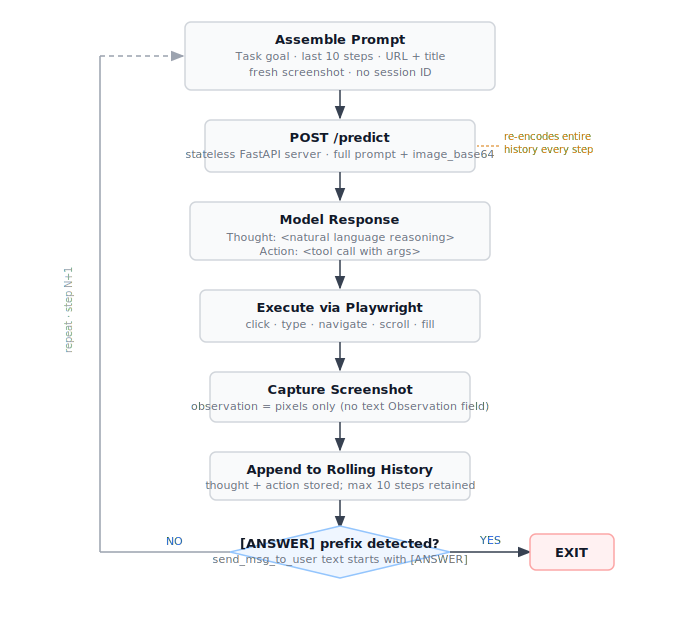

> **TL;DR:** Ai2 delivered: training code, benchmark runner, annotation tool, and base checkpoints are now public — the repo went from incomplete to complete, but operationally rough. The structural reproducibility concerns survived: `run_train.sh` defaults reproduce roughly 1% of the paper's training budget with no warning; ScreenSpot appears as both a training input and the headline grounding benchmark with no documented split separation; pass@4 (94.7%) isn't achievable without rolling your own parallel rollout orchestration; and GPT-4o filtered the synthetic training data and grades the primary benchmark. Naming these isn't a critique of Ai2, since they're more transparent than any comparable research lab in this space. The point is that if these patterns appear in the most carefully documented open GUI agent release to date, I'd expect similar patterns to be common in regulated banking deployments moving faster and with less documentation discipline — and HuggingFace download numbers suggest most practitioners aren't engaging deeply with the internals.

This is Part 2 of a two-part series on MolmoWeb. [Part 1](post.html?slug=molmoweb-data-flywheel) covers the training data inversion — the ablation showing synthetic AxTree trajectories beat human demonstrations by 17 points at matched scale, and what that means for annotation quality assumptions.

Six weeks after launch, Ai2 dropped the rest of the code. The `training/`, `benchmarks/`, and `annotation/` directories — referenced throughout the original README but absent from the repository tree, are now populated, the placeholder closing section replaced by 17KB of operational documentation. Two "Pretrained" base checkpoints are available, a custom Chrome extension for recording human task demonstrations is documented, and the benchmark runner is a Python Fire CLI with four supported benchmarks and four agent backends.

This is genuinely unusual. Most research labs ship the paper and the weights. Ai2 shipped the weights, the training data, the training code, the evaluation suite, the annotation tool, and the paper — all under Apache 2.0 and ODC-BY 1.0. For GUI agents specifically, nothing else is this open at this performance level.

And now that everything is visible, we can read what "complete" actually means in practice.

## The agent loop

The MolmoWeb agent loop is a clean ReAct implementation built on Playwright, separated into a stateless model server and a stateful browser client.[^1] Each step, the agent assembles a prompt from four components: the task goal, the last 10 action steps (each carrying its `thought` and `action` fields), the current URL and page title, and a fresh screenshot — and sends it to the model server via a single `POST /predict` endpoint accepting `{prompt, image_base64}`.

The server returns a structured `Thought: <NL>\nAction: <call>\n` string. The agent parses the action, executes it via Playwright, captures a new screenshot, appends to rolling history, and repeats. There is no "Observation:" field because the observation is the raw screenshot, a design consequence of operating from pure pixel input. The textual transcript of any run loses every observation that was only ever encoded as pixels.

State is fully resent every step. There is no session ID, no KV-cache reuse, and no streaming. A 30-step rollout re-encodes the full prompt and screenshot history thirty times. The only documented parallelism is `NUM_PREDICTORS=N` for process-level fan-out behind FastAPI, plus a `run_batch(max_workers=3)` client-side pool for concurrent task execution. The termination contract is implicit: the loop terminates when the model emits a `send_msg_to_user` call whose text begins with `[ANSWER]`. This prefix doesn't appear in the README; it surfaces only in the demo notebook and as the closing string in HumanTrajs samples.[^2]

There is a sharp coordinate-space edge the documentation doesn't flag. Training trajectories in HumanTrajs embed actions with absolute pixel coordinates. The PixMoPoints perception data uses 0–100 percent coordinates. Reconciling these requires knowing the screenshot resolution at every training step, which is plausible inside the data loader but not described in the README. At inference, the client defaults silently to Playwright's 1280×720 — a user running at 1920×1080 will shift the entire click distribution without warning.

<figure>
  
  <figcaption style="text-align:center;font-size:0.85rem;color:#6b7280;margin-bottom:1rem;">The MolmoWeb ReAct agent loop. State is fully re-encoded every step: no session ID, no KV-cache reuse. The <code>[ANSWER]</code> termination contract is implicit: it surfaces in the demo notebook but is absent from the README.</figcaption>
</figure>

## The defaults that don't match the paper

The training entry point is `launch_scripts.train <config> <run_name>`, invoked via `torchrun`. Most practitioners will reach the shell wrapper first: `run_train.sh`. The README's variable table tells the story:

| Variable | Script default | Paper | Gap |
|---|---|---|---|
| `CHECKPOINT_PATH` | `MolmoWeb-Pretrained-4B` | 8B for headline numbers | Model size |
| `NUM_GPUS` | 8 | 64 | 8× |
| `GLOBAL_BATCH_SIZE` | 64 | 128 | 2× |
| `DURATION` | **500 steps** | **50,000 steps** | **1%** |

A naive `bash run_train.sh` runs roughly one-hundredth of the paper's training compute, on the smaller model, with half the global batch size. There is no warning in the README.[^3] Learning rate and warmup schedule aren't in the variable table at all; they live inside the `launch_scripts.train` config indexed by mixture name, documented only by example. The "Pretrained" base checkpoints are also mildly misleading: `MolmoWeb-Pretrained-8B` and `MolmoWeb-Pretrained-4B` are Molmo2 single-image base weights repackaged under a MolmoWeb path. They are not an intermediate web-domain pretraining stage distinct from the base model.

The benchmark CLI has its own gap. The benchmark runner defaults to `max_steps=30`, well below the paper's 100, with no README note. Reproducing the paper's pass@1 numbers requires overriding the default. Reproducing pass@4 (94.7% on WebVoyager, the headline number in most external coverage) requires rolling your own orchestration entirely — there is no `pass_at_k`, `n_rollouts`, or `best_of_n` flag in the documented CLI.[^4] The paper describes m=5 parallel rollouts per task with VLM-judge best-of-N selection; none of that is exposed in `benchmarks.py`.

## Three evaluation concerns that survived the code drop

**The LLM-judge contamination loop** is now well-documented and unresolved. The multi-agent synthetic training pipeline uses GPT-4o as a screenshot verifier, deciding which Gemini-generated trajectories MolmoWeb learns from. The WebVoyager benchmark judge is also GPT-4o. The same model that selected which training trajectories were worth learning from is deciding whether MolmoWeb's web behavior counts as successful at evaluation time. This isn't catastrophic — the verifier's decisions reduce to a binary success label feeding the training sample filter, not direct preference supervision — but the dominant evaluation signal shares an inductive bias with the dominant training filter.[^5] For the general measurement reliability concerns with LLM-judge evaluation, see [metrics-metrics-metrics](post.html?slug=metrics-metrics-metrics).

**ScreenSpot as both training data and benchmark** is now sharper, because the dual use is baked into the documented training flow rather than being implicit. The grounding specialist evaluation (MolmoWeb-Ground-8B at 91.8% on ScreenSpot v2, ahead of Claude 3.7 Computer Use and OpenAI CUA) runs on ScreenSpot test and ScreenSpot-v2 test. ScreenSpot is also listed in the training data download table. The README's `run_ground_eval.sh` convention implies "train on non-test splits, eval on test" — but the README does not explicitly disclaim that ScreenSpot test rows are filtered from the training mixture, and no contamination audit is documented. The finding here is a documentation gap. There is no positive evidence of contamination — but the gap matters because a user cannot confirm split separation was correctly implemented without running that audit independently.

**No URL or task-level deduplication** between the synthetic training trajectories (spanning 2,600 high-traffic web domains) and the evaluation benchmarks (drawn from the same domain pool) remains undocumented. The runner logs which seed and judge model version produced any given run, but there is no programmatic success checker independent of the LLM judge.

## Security surface

One new concern in the updated release matters specifically for anyone thinking about banking deployment. MolmoWeb's agent has no URL allowlist, no URL blocklist, and no prompt-injection mitigation for on-screen text instructions. Any page the agent visits can display text attempting to redirect its behavior. The lead author's documented mitigation is "don't ask the model to do sensitive things."

That's a defensible stance for a research demo; it fails immediately in enterprise deployment. A GUI agent inside a bank is by definition asked to do sensitive things — that is the entire point of deploying it. Prompt injection via on-screen text is a live and active attack surface for screenshot-driven agents: any authenticated portal the agent visits can attempt to socially engineer it. The codebase leaves this entirely to the deployer to address. The minimal mitigation is a URL allowlist enforced at the Playwright client layer, treating off-allowlist navigation as a terminating condition. For the broader attack taxonomy, see [a2a-risks](post.html?slug=a2a-risks).

The `max_position_embeddings = 10240` context cap (versus Molmo2's 36,864) is a related sharp edge: long sessions with embedded screenshots will silently truncate. This is confirmed as the proximate cause of [vLLM crash issue #38660](https://github.com/vllm-project/vllm/issues/38660), which independently corroborates the README's caveat about vLLM incompatibility.

## What regulated AI deployment can learn from this

I want to be precise about the argument. AI2 is being more transparent than almost any research lab in the GUI agent space. The patterns I'm naming are findable precisely because they released everything. The `run_train.sh` default mismatch, the ScreenSpot dual-use, the LLM-judge loop, the implicit `[ANSWER]` contract — none of these would be visible if Ai2 hadn't shipped the training code and evaluation suite alongside the model.

The patterns themselves aren't signs of carelessness. They're endemic to building and shipping complex ML systems quickly. Defaults accumulate during development and don't always get updated before publication. Evaluation datasets overlap with training inputs when both pipelines target the same popular domains. Termination contracts that seem obvious to the team that built the system don't always make it into documentation written under deadline pressure.

The repo has 543 stars, an updated 492-line README, and a visible primary committer, but no GitHub Actions workflows, no `tests/` directory, and zero open issues or pull requests. For a banking team evaluating this as a foundation for internal tooling, the absence of community-surfaced issues signals low engagement with the internals; it doesn't mean the issues don't exist.

SR 26-2, which superseded SR 11-7 in April 2026, explicitly carved out GenAI and agentic AI from scope, meaning no binding framework currently mandates the kind of implementation audit this post describes.[^7] For teams deploying via closed-weight APIs rather than open weights, the specific failure modes differ; there's no `run_train.sh` to misconfigure. But the underlying pattern — behavioral assumptions never verified against actual configuration — generalizes across deployment types. For a treatment of the SR 26-2 exclusion and what it leaves unresolved, see [hitl-vocabulary](post.html?slug=hitl-vocabulary).

The specific pattern I find most instructive is the `run_train.sh` default mismatch. The script exists, it runs, and it will produce a trained model. It will just produce a model trained at a fraction of the paper's compute budget, and nothing warns you. In model risk governance terms, this is a documentation gap that [effective challenge](post.html?slug=effective-challenge) is designed to catch — the kind of thing an independent validator who reads the defaults table and compares it against the paper's reported configuration would flag. Under time pressure, that comparison often doesn't happen. Under institutional pressure to ship, it happens even less.

The codebase is fully populated now, which is more than most comparable releases can claim. What I'm watching is whether the banking teams building on open-weight GUI agents are running the equivalent of this audit before calling the model validated — checking that defaults match reported conditions, that evaluation datasets aren't in the training mixture, that headline numbers are actually reproducible from the released artifacts. My read, based on how quickly these deployments have been moving and on how few practitioners appear to be engaging with the internals, is that most are not.

[^1]: The MolmoWeb agent architecture is documented in the [demo notebook](https://github.com/allenai/molmoweb/blob/main/demo.ipynb) and the `inference/` and `agent/` directories of the [allenai/molmoweb repository](https://github.com/allenai/molmoweb). The two-tier design (stateless FastAPI model server + stateful Playwright client) cleanly separates GPU concerns from browser concerns but means the inference path has no cross-step state.

[^2]: The `[ANSWER]` termination contract is visible in `demo.ipynb` and as the closing string in HumanTrajs samples. The annotation tool — now a Chrome extension recording (screenshot, action) pairs across 1,100+ websites — emits the same JSON-keyed-by-step-index format the trainer ingests, which is a meaningful fix to a previously opaque part of the pipeline. Whether the agent terminates on any `send_msg_to_user` call or specifically on the `[ANSWER]` prefix, and whether the prefix is stripped before being returned to the caller, remain undocumented in the README.

[^3]: The `run_train.sh` defaults table is derived from the README's documented variable table compared against the paper's reported training configuration in [arXiv §3](https://arxiv.org/html/2604.08516v1). The training entry point is `launch_scripts.train` (OLMo-core as the underlying trainer, FSDP rather than DeepSpeed). The `MolmoWeb-Pretrained-{8B,4B}` checkpoints are documented in training instructions as "Molmo2 pretrained checkpoint" — i.e., the Molmo2 single-image base weights repackaged under a MolmoWeb path.

[^4]: The benchmark runner (`benchmarks/benchmarks.py`) is a Python Fire CLI with `run` and `judge` subcommands. The `run` subcommand exposes `agent_type`, `benchmark`, `num_workers`, `max_steps`, `env_type`, and `inference_mode`. No `pass_at_k`, `n_rollouts`, or `best_of_n` flag appears in the documented CLI. The model card prominently advertises 94.7% pass@4 on WebVoyager and 60.5% pass@4 on Online-Mind2Web; reproducing either requires implementing the parallel-rollout-and-pick loop outside the provided tooling. [Allen AI paper page](https://allenai.org/papers/molmoweb).

[^5]: The LLM-judge contamination loop: the multi-agent synthetic training pipeline uses GPT-4o as a screenshot verifier; the WebVoyager benchmark judge is GPT-4o via `OPENAI_API_KEY`. The same model that filtered which trajectories MolmoWeb learned from is grading MolmoWeb's task completions. [arXiv paper §4](https://arxiv.org/html/2604.08516v1). The paper also conspicuously omits UI-TARS-2 (September 2025, 88.2 on Online-Mind2Web) from the comparison table — a stronger contemporary than UI-TARS-1.5, which is included.

[^7]: SR 26-2 (effective April 17, 2026) is a joint Federal Reserve/OCC/FDIC model risk management guidance that superseded SR 11-7. Footnote 3 of SR 26-2 explicitly excludes generative AI and agentic AI systems from scope. [SR 26-2](https://www.federalreserve.gov/supervisionreg/srletters/sr2602.htm).

[^6]: External reception covered by [VentureBeat](https://venturebeat.com/data/ai2-releases-molmoweb-an-open-weight-visual-web-agent-with-30k-human-task-trajectories-and-a-full-training-stack/), [Ken Yeung / The Letter Two](https://thelettertwo.com/2026/03/24/ai2-molmoweb-molmowebmix-web-agent-open-source), and [Awesome Agents](https://awesomeagents.ai/news/molmoweb-ai2-open-source-web-agent/). HuggingFace download volume: ~3K for MolmoWeb-4B HF, ~2.5K for MolmoWeb-8B HF — orders of magnitude below Molmo-7B's ~454K, suggesting modest practitioner uptake relative to the "first fully open visual web agent" framing.
