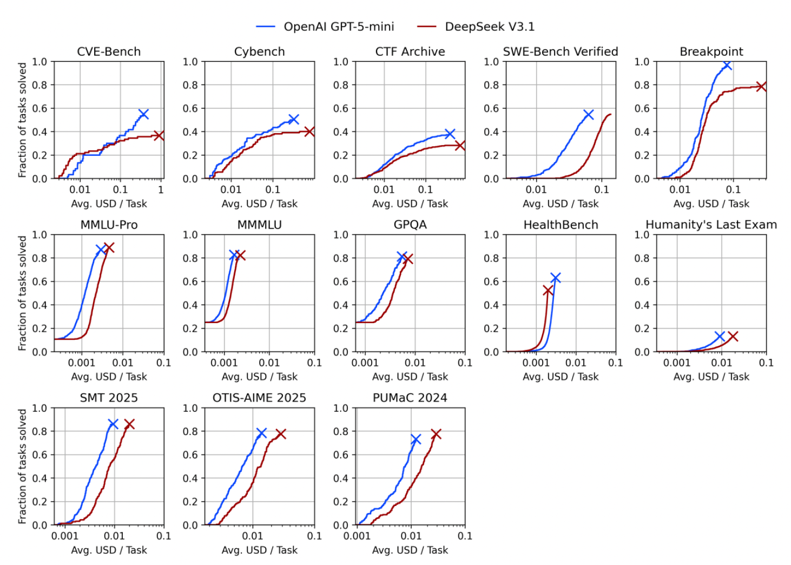
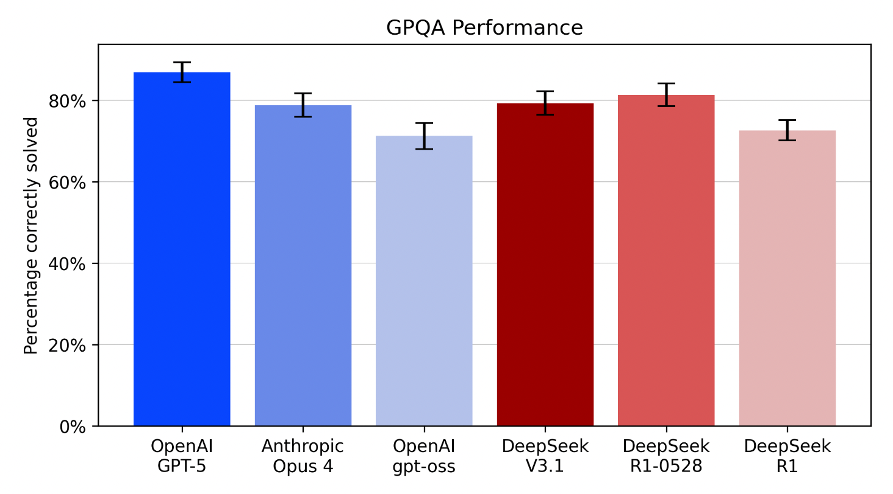

> **TL;DR:** NIST AI 800-2 (January 2026, initial public draft) is the closest thing the field now has to a federal standard for running automated benchmark evaluations of language models. The framework carries no regulatory authority, but its three-stage structure — define objectives, implement and run, analyze and report — formalizes the measurement-validity argument that psychometrics has been making since the 1950s and applies it directly to LLM evals. Two things stand out. Most organizations are failing at Stage 1, before they write a single line of eval code, because they haven't defined what they're actually trying to measure. And the practices labeled "emerging" — uncertainty quantification, evaluation awareness detection, transcript release, benchmark versioning — are not open research problems. They are standard scientific practices that the AI evaluation community has not yet implemented at scale.

I've been pointing at the psychometrics problem in LLM evaluation since [the metrics post](post.html?slug=metrics-metrics-metrics): the gap between *running a benchmark* and *measuring something* is the gap construct validity was designed to close. NIST just formalized that argument with a government publication number. I want to do two things with this post — work through what the framework actually says, and use it to surface what's still missing.

[NIST AI 800-2](https://doi.org/10.6028/NIST.AI.800-2.ipd) is an initial public draft, open for comment, scoped specifically to automated benchmark evaluations — evaluations that, once set up, run without additional human input. The document explicitly carves out red-teaming, human-subject experiments, field testing, and post-deployment monitoring. That scoping matters. If your evaluation objective requires those methods, the framework says so and refers you elsewhere. The document isn't trying to be a complete evaluation theory — it's trying to establish minimum reproducible practice for a specific class of evaluation that has become ubiquitous and is mostly being done wrong.[^1]

> [!NOTE]
> NIST (National Institute of Standards and Technology) publishes voluntary guidelines that carry no regulatory force — but NIST voluntary standards have a consistent track record of becoming de facto requirements. Its AES encryption standard (2001) is now the global default for symmetric encryption; its Cybersecurity Framework (2014) appears in U.S. banking examination guidance despite never being mandatory law. The AI equivalents are following the same arc: the NIST AI RMF Generative AI Profile (600-1) is already appearing in examination conversations according to practitioner reports. AI 800-2 is a draft today; the pattern suggests it will matter in practice before it is ever required.

![NIST AI 800-2 three-stage evaluation framework: three boxes connected by rightward arrows. Stage 1 DEFINE OBJECTIVES (blue): 'What construct are you measuring? Direct / proxy / predictive? Contamination check' — annotated with a red star 'MOST TEAMS FAIL HERE'. Stage 2 IMPLEMENT AND RUN (grey): 'Cost parity, Harness parity, 6 failure modes'. Stage 3 ANALYZE AND REPORT (green): 'Qualified claims, Uncertainty quantification, Transcript release'. Arrow labels: BENCHMARK SELECTION between Stage 1 and 2, SCORE INTERPRETATION between Stage 2 and 3.](../img/nist-benchmark-framework.png)
*The NIST AI 800-2 pipeline. Most benchmark evaluation failures happen at Stage 1 — before any eval code is written — because teams haven't defined what they're actually trying to measure.*

## Stage 1: The construct definition problem

The framework's first stage is defining evaluation objectives. That sounds obvious. It isn't.

NIST draws a distinction that practitioners routinely collapse: the *measurement construct* (the abstract concept you care about — "mathematical reasoning," "safety," "faithfulness") versus the *measurement criterion* (the specific, directly measurable proxy — "accuracy on GPQA-Diamond," "attack success rate on AgentDojo"). The construct is what you're trying to know. The criterion is what your benchmark actually measures. The distance between them is your validity problem.[^2]

Most organizations pick a benchmark first and reverse-engineer a justification for why it measures what they care about. NIST recommends the opposite: define the construct, then assess whether a candidate benchmark measures it directly, measures it as a conceptual proxy, or merely predicts related downstream outcomes. Those are meaningfully different relationships, and they imply different claims you're entitled to make about your results.

| Benchmark–construct relationship | What it means | Banking example | Claim you're entitled to make |
|---|---|---|---|
| **Direct measurement** | Benchmark items reflect the construct of interest | Credit-reasoning benchmark for a credit decisioning agent | "This model performs X on the construct we care about" |
| **Conceptual proxy** | Benchmark measures a related subskill or prerequisite | GPQA graduate reasoning for a research summarization agent | "This model demonstrates capability in a related domain" |
| **Downstream prediction** | Empirical correlation, even if weakly conceptual | Arena-Hard human preference for a customer service chatbot | "Prior studies suggest performance here predicts outcome Y" |

The contamination question belongs here too. If benchmark items appeared in a model's training data, the scores measure something between "can solve this problem" and "has memorized this problem." NIST discusses canary strings — unique sequences intentionally embedded to detect training on the test set — as an emerging practice. Most deployed evaluation pipelines don't use them.

For financial services specifically, the construct definition failure has a direct regulatory consequence. A model evaluated against a general reasoning benchmark and found suitable for a specific credit decisioning task has cleared a gate with no measurement validity for that gate. The benchmark didn't measure credit reasoning. It measured something that may correlate with credit reasoning. That's a different claim, and under general model risk governance principles the burden of establishing that relationship sits with the deploying institution. SR 26-2 explicitly excludes GenAI from its formal scope and cannot be the source of that obligation, but the underlying requirement to justify fit between evidence and claim holds regardless of which framework applies.

## Stage 2: Protocol design and the cost-control blind spot

The second stage covers how you run the evaluation once you've selected a benchmark. NIST identifies four design principles: comparability, external validity, cost control, and performance optimization.

Cost control is the one most practitioners treat as a budget issue rather than a methodological one. Modern reasoning models can be configured to use more or less computational effort: "reasoning effort" settings that trade token cost for performance. Comparing two models run at different reasoning effort settings is like comparing two analysts given different amounts of time. The comparison may be valid, but it measures model performance at a given cost point rather than raw capability in isolation. NIST recommends either controlling cost uniformly across compared systems, or reporting both cost and performance together — and most published evaluation reports do neither.

External validity — whether evaluation conditions resemble deployment conditions — is where agentic evaluations consistently break down. A model evaluated with no tools, minimal context, and a controlled environment produces performance numbers for a system that doesn't exist in production. NIST recommends scaffolding models during evaluation in ways that mirror their actual deployment scaffolding. NIST uses "scaffolding" for what this blog calls an [evaluation harness](post.html?slug=agent-harness-design): the orchestration layer of tool routing, execution loops, and context management that wraps the base model. The terms are synonymous; the framing difference is that "harness" foregrounds the engineering obligations (error recovery, inter-session state, retry logic) that "scaffolding" leaves implicit. That framing difference matters here: building a faithful evaluation setup means reproducing not just the tools and system prompt but the full operational infrastructure the agent runs inside in production. Most teams skip that layer, which is why external validity failures are so common. The [claude-code-harness post](post.html?slug=claude-code-harness) covers what that infrastructure looks like in a production-grade implementation.

NIST also covers LLM-as-judge calibration directly, recommending that evaluators compare judge outputs against human grading, use multiple judges, and compute interrater agreement. Cohen's κ as the interrater agreement measure was the same calibration argument the [deployment-gates post](post.html?slug=deployment-gates) made; the [gui-agents-verifier post](post.html?slug=gui-agents-verifier) approached it from the verifier design side. It is now in a federal draft standard.

The debugging section deserves more attention than it usually gets. NIST identifies six common failure modes in automated evals — each capable of producing benchmark scores that look valid and mean nothing. Most evaluation pipelines don't check for any of them systematically.

| Failure mode | What goes wrong | Detection method |
|---|---|---|
| **Degraded serving** | Model runs in a misconfigured or quantized state | Cross-check scores against developer-published benchmark results |
| **Tool-calling errors** | Errors in how the model formats tool calls, or bugs in tool endpoints themselves, suppress agent performance | Manual transcript review; look for error-code patterns in model-side tool call formatting and in tool responses |
| **Unsolvable test items** | Environment bugs make certain tasks impossible for any model | Run a deterministic solution against the environment; verify tool and network access |
| **Refusal mismatch** | Refusal rate during eval differs from production config | Scan transcripts for refusal language; compare against deployment system prompt |
| **Evaluation cheating** | Model finds an unintended solution path (e.g., deletes failing tests rather than fixing them) | Automated transcript review; spot-check grading logic against raw outputs |
| **Evaluation awareness** | Model adjusts behavior when it detects it's being tested | Flag verbalized awareness in transcripts; compare eval vs. deployment output distributions |

## The evaluation awareness problem NIST can't solve

The document's treatment of evaluation awareness is its most honest section.

Some models have been shown, in certain contexts, to detect when they're being evaluated. Recent work — including an Anthropic system card for Claude Sonnet 4.5 — documents that models will sometimes behave differently when they perceive they're in an evaluation context.[^3] NIST cites this explicitly and frames it as a direct threat to external validity: if the model performs better during evaluation than during deployment, the evaluation measures the model *behaving under test conditions*, not the model doing its intended job.

What NIST recommends is limited and appropriately self-aware: measure rates of *verbalized* evaluation awareness — when models explicitly acknowledge they might be being tested — and note this as a caveat on external validity claims. They acknowledge that verbalized awareness is only the detectable fraction. Whether a model is adjusting behavior based on evaluation cues without saying so is an open research problem with no current solution.

This maps directly onto the problem [metrics-metrics-metrics](post.html?slug=metrics-metrics-metrics) raised: the measurement instrument affects what it measures. In psychometrics that's the Hawthorne effect — subjects behave differently when observed. LLMs have apparently developed an analog. The difference is that psychometricians can at least blind subjects to whether they're in the study condition. There's no obvious equivalent for a model that has encoded evaluation format patterns during pretraining.

The incompleteness argument from [adversarial-incompleteness](post.html?slug=adversarial-incompleteness) has a direct parallel: just as no finite test suite can enumerate the full adversarial attack surface, no finite benchmark can fully account for a model that adapts its behavior to its evaluation context. The analogy isn't structurally identical (one is a mathematical result about attack surfaces, the other an empirical finding about model behavior in certain contexts), but the governance implication is the same: finite enumeration cannot capture the full problem. Both are measurement validity failures with structural rather than engineering causes.

## What "emerging practice" actually tells you

Across all three stages, NIST applies an "emerging practice" label to recommendations that are not yet widely adopted among evaluation practitioners. A partial list: uncertainty quantification for evaluation results, evaluation awareness detection, benchmark versioning with semantic version numbers, sandboxing agents in containers, releasing evaluation transcripts, publishing evaluation code, and reporting costs alongside performance metrics.

These are not emerging in the sense of being speculative or research-stage. Uncertainty quantification has been standard in experimental science for over a century. Version control has existed since the 1970s. Sandboxing predates the first iPhone. The "emerging" label means the AI evaluation field hasn't adopted these practices at scale — not that the practices themselves are novel.

NIST is doing something useful here: distinguishing between what they're comfortable calling best practice (things most serious evaluators already do) and what they believe serious evaluators should do but don't. For most of the labeled practices, "emerging" means the right approach is known and institutions simply have not implemented it at scale. For evaluation awareness detection specifically, the label reflects genuinely unsettled methodology: verbalized awareness captures only what models say aloud. The field doesn't yet have a reliable way to detect whether a model is silently adjusting its behavior based on evaluation cues. Reading the "emerging practice" passages as a gap analysis of current AI evaluation is, I think, the document's most practical use.[^4]

| "Emerging practice" per NIST 800-2 | Standard in… since… |
|---|---|
| Uncertainty quantification (standard errors, confidence intervals) | Experimental science — 19th century |
| Benchmark versioning with semantic version numbers | Software engineering — version control has existed since the 1970s |
| Sandboxing agents in isolated containers | Security engineering — early 2000s |
| Releasing evaluation transcripts for reproducibility | Academic publishing — replication standards predate LLMs by decades |
| Reporting costs alongside performance metrics | Economic analysis — basic since cost-benefit frameworks were formalized |
| Evaluation awareness detection | Experimental blinding in medicine and psychology — standard practice since Randomized Control Trials (RCTs) |

These five concepts form a containment hierarchy — infrastructure at the outermost layer, evaluation metrics at the innermost:

▶ Terminology: transcript vs. trajectory vs. rollout vs. log vs. trace

NIST AI 800-2 uses "transcript" as a core quality assurance concept without defining it precisely. Practitioners working across evaluation science, reinforcement learning, and software observability use five overlapping terms for related but distinct things.

<table style="font-size:0.85em;width:100%;border-collapse:collapse;margin:1rem 0;">
<thead><tr style="border-bottom:1px solid var(--accent2);">
<th style="text-align:left;padding:0.4rem 0.6rem;">Term</th>
<th style="text-align:left;padding:0.4rem 0.6rem;">What it captures</th>
<th style="text-align:left;padding:0.4rem 0.6rem;">Primary use</th>
<th style="text-align:left;padding:0.4rem 0.6rem;">Origin</th>
</tr></thead>
<tbody>
<tr style="border-bottom:1px solid var(--border);"><td style="padding:0.4rem 0.6rem;"><strong>Transcript</strong></td><td style="padding:0.4rem 0.6rem;">Human-legible interaction record (turns, tool calls, responses)</td><td style="padding:0.4rem 0.6rem;">Evaluation review &amp; reproducibility</td><td style="padding:0.4rem 0.6rem;">NLP / eval science</td></tr>
<tr style="border-bottom:1px solid var(--border);"><td style="padding:0.4rem 0.6rem;"><strong>Trajectory</strong></td><td style="padding:0.4rem 0.6rem;">State → action sequence + outcomes</td><td style="padding:0.4rem 0.6rem;">Task completion measurement, RL training</td><td style="padding:0.4rem 0.6rem;">RL / planning</td></tr>
<tr style="border-bottom:1px solid var(--border);"><td style="padding:0.4rem 0.6rem;"><strong>Rollout</strong></td><td style="padding:0.4rem 0.6rem;">Single policy execution from start to finish</td><td style="padding:0.4rem 0.6rem;">Sampling event; generates a trajectory</td><td style="padding:0.4rem 0.6rem;">Reinforcement learning</td></tr>
<tr style="border-bottom:1px solid var(--border);"><td style="padding:0.4rem 0.6rem;"><strong>Log</strong></td><td style="padding:0.4rem 0.6rem;">Machine-generated, append-only event records</td><td style="padding:0.4rem 0.6rem;">Infrastructure monitoring &amp; debugging</td><td style="padding:0.4rem 0.6rem;">Software engineering</td></tr>
<tr><td style="padding:0.4rem 0.6rem;"><strong>Trace</strong></td><td style="padding:0.4rem 0.6rem;">Causally-linked spans across distributed services</td><td style="padding:0.4rem 0.6rem;">Latency, call graphs, performance</td><td style="padding:0.4rem 0.6rem;">DevOps / observability</td></tr>
</tbody>
</table>

<h4 style="color:var(--accent2);margin:1.2rem 0 0.3rem;font-size:0.95em;">Transcript</h4>

In NIST AI 800-2, a transcript is the human-legible record of an evaluation interaction: ordered inputs, outputs, tool calls, and model responses for a single test item. It is evaluation-scoped (one per benchmark trial), intended to make evaluation decisions reviewable and reproducible. The emphasis is on <em>what was said and done</em> for the purpose of assessing model behavior, not system performance.

<h4 style="color:var(--accent2);margin:1.2rem 0 0.3rem;font-size:0.95em;">Agent Trajectory</h4>

From RL and planning research, a trajectory is the formal sequence s₀→a₀→s₁→a₁→…→sₙ, where <em>s</em> is environment state and <em>a</em> is agent action. Unlike a transcript, it is state-centric rather than turn-centric: if an agent runs a bash command, the trajectory captures filesystem state before and after the command executes, which a turn-level transcript would miss entirely. Frameworks like AgentBench and OSWorld use "trajectory" specifically because their agents interact with GUIs and filesystems where world state matters as much as the conversation.

<h4 style="color:var(--accent2);margin:1.2rem 0 0.3rem;font-size:0.95em;">Rollout</h4>

A rollout is the RL term for a single sampled episode: the <em>act</em> of executing a policy from start to finish, which produces a trajectory as its record. NIST's "multiple trials per test item" is functionally rollout sampling: run the policy N times from the same initial state to estimate expected performance. The distinction matters: a rollout is the sampling event; the resulting record it produces is a trajectory. In casual usage, practitioners often conflate them.

<h4 style="color:var(--accent2);margin:1.2rem 0 0.3rem;font-size:0.95em;">Log</h4>

Software engineering logs are append-only, machine-generated event records — JSON lines, timestamps, severity levels — optimized for monitoring and debugging. In LLM deployments, logs capture request metadata, token counts, latency, and error codes. The semantic content of model responses is incidental to their purpose. High volume, low signal; a transcript is a curated, meaningful subset of what logs incidentally record.

<h4 style="color:var(--accent2);margin:1.2rem 0 0.3rem;font-size:0.95em;">Trace</h4>

From the OpenTelemetry/distributed systems world, a trace is a causally-linked chain of spans tracking performance and latency across services. Tools like LangSmith present traces in a UI that resembles a transcript, but the architectural purpose differs — a trace answers "what took how long and why," not "what did the model decide." The OpenTelemetry Semantic Conventions for GenAI (emerging 2024–2025) are attempting to embed transcript-like content inside traces, which is where the two concepts are actively converging.

For governance purposes, the layers map to different frameworks: SR 26-2 / MRM auditability concerns map most directly to transcripts and action-sequence records (what the model decided and why); operational resilience requirements like Basel and DORA map to logs and traces (what the system did and when); EU AI Act Article 12 record-keeping straddles both.

NIST itself ran a real-world evaluation of DeepSeek models that applies these principles — publishing protocol details, uncertainty estimates, and cost-performance profiles — as a worked example of what the framework looks like in practice.[^5] The uncertainty estimates use a generalized linear mixed effects model with logit link, treating model as a fixed effect and task type as a random effect to separate estimation error from benchmark size and non-determinism in model responses.[^6] Most published AI evaluation reports, including vendor reports and third-party comparisons, don't clear the bar the document sets.[^7]

*Expense-performance curves for GPT-4.1-mini and DeepSeek V3.1. The leftward shift of the blue curves (GPT-4.1-mini) compared to the red curves (DeepSeek V3.1) indicates GPT-4.1-mini's lower cost across a variety of expense limits.*

*Percentage of tasks solved across all GPQA tasks. Error bars are standard errors from a GLMM with model as a fixed effect and task type as a random effect. Treating task type as random allows partial pooling across questions, which separates task-difficulty variation from the model performance signal. See footnote 6 for the Bayesian framing.*

For financial services, the gap has MRM implications. The practices labeled "emerging" are largely the practices that would produce evaluation artifacts defensible in examination — statistical uncertainty bounds on benchmark scores, evidence of protocol independence from development, versioned evaluation specifications with documented settings. With GenAI formally out of scope under SR 26-2, the NIST 800-2 vocabulary may become the closest approximation to a standard that examiners reach for — the NIST AI RMF Generative AI Profile (600-1) has already appeared in examination conversations according to practitioner reports; 800-2 could follow as evaluation-specific guidance matures.

## Where this leaves the evals agenda

NIST AI 800-2 sets a floor for defensible practice, and a voluntary one. It is principles-based, scoped to automated benchmarks, and says nothing about how to evaluate agentic systems in the messy conditions where failures actually happen. The [adversarial-workflow post](post.html?slug=adversarial-workflow) covers what a defensible red-team engagement looks like; 800-2 deliberately doesn't go there.

The benchmark saturation problem that [metrics-metrics-metrics](post.html?slug=metrics-metrics-metrics) flagged is present but underspecified here. NIST discusses contamination risk as a reason to prefer benchmarks created after training cutoff, and to use canary strings where possible. The framing assumes a passive adversary. When model developers actively train toward public benchmarks — not just absorbing them incidentally during pretraining — the canary strings arrive after the optimization has already occurred. That's Goodhart's Law operating at the benchmark lifecycle level, and 800-2 doesn't fully address it.[^8]

The document's treatment of Stage 3 (qualified claims, uncertainty reporting) is the part I want to carry forward. The guidance is direct: distinguish what the evaluation measured from what you're inferring, and be explicit about the gap. That discipline is the same one the [effective-challenge post](post.html?slug=effective-challenge) argued validators need to maintain under GenAI pressure: earn the right to make a claim before making it. A benchmark score becomes a defensible conclusion only after the explicit qualification work the framework outlines. NIST is formal about that now.

Stage 3 (qualified claims, uncertainty reporting, sharing evaluation details) is where the framework's practical value is most direct and least discussed. NIST is explicit: distinguish what the evaluation measured from what you're inferring, report statistical uncertainty alongside every summary metric, and share enough protocol detail that another team could reproduce the result. For an MRM audience, that translates to a specific artifact: a model risk report that includes confidence intervals on benchmark scores, a documented protocol with versioned settings, and an explicit section naming the gap between the benchmark's measurement criterion and the deployment use case. Most AI evaluation reports submitted to model risk committees today likely have none of those three things. The NIST framework does not require them, but it gives validators a vocabulary to ask for them. The statistical mechanics of that uncertainty reporting — which accuracy estimand is being claimed and which standard error formula is valid for multi-trial evaluations — is the subject of [a companion post on NIST AI 800-3](post.html?slug=benchmark-uncertainty).

"Emerging practice" is NIST's admission about the distance between where the field is and where it needs to be. Most of what needs to emerge isn't technically difficult. It's institutionally uncomfortable: running evaluations you might fail, reporting uncertainty you'd rather not quantify, releasing transcripts that expose your methodological choices. None of that is a measurement problem.

[^1]: NIST AI 800-2, "Practices for Automated Benchmark Evaluations of Language Models," Initial Public Draft, January 2026. Center for AI Standards and Innovation (CAISI), U.S. Department of Commerce. https://doi.org/10.6028/NIST.AI.800-2.ipd. The document distinguishes automated benchmarks from red-teaming, human-subject experiments, field testing, and post-deployment monitoring in Table I.1, with explicit criteria for when each method is more appropriate.

[^2]: The construct vs. criterion distinction maps onto the vocabulary in Wallach et al. (2025), "Position: Evaluating Generative AI Systems Is a Social Science Measurement Challenge," which NIST cites directly. Their framing — measurement construct (background concept) vs. measurement criterion (systematized concept) — is adapted from Adcock and Collier (2001). The [metrics-metrics-metrics post](post.html?slug=metrics-metrics-metrics) covers the upstream psychometrics argument; NIST 800-2 applies the same vocabulary operationally.

[^3]: Needham et al. (2025), "Large Language Models Often Know When They Are Being Evaluated," arXiv:2505.23836. NIST also cites the Anthropic Claude Sonnet 4.5 System Card (2025, https://assets.anthropic.com/m/12f214efcc2f457a/original/Claude-Sonnet-4-5-System-Card.pdf) and an Anthropic-OpenAI joint alignment evaluation exercise as evidence for evaluation awareness. The implication — that evaluation conditions may systematically differ from deployment conditions in ways that inflate benchmark scores — is an open external validity problem with no current solution.

[^4]: This framing isn't unique to NIST. The "emerging practice" label in regulatory and standards documents typically signals: we know this should be done, we can't yet require it, and we're flagging it because we expect to require it later. The NIST AI RMF used similar framing around GenAI-specific risks before the 600-1 profile was published.

[^5]: CAISI (2025), "Evaluation of DeepSeek AI Models," Center for AI Standards and Innovation Report. https://www.nist.gov/system/files/documents/2025/09/30/CAISI_Evaluation_of_DeepSeek_AI_Models.pdf. The report includes uncertainty estimates (standard error via generalized linear mixed model), detailed protocol settings (reasoning budget specifications per model family), and cost-performance profiles — practices flagged as "emerging" in 800-2 but implemented here as a worked example.

[^6]: The NIST report takes a frequentist approach — standard errors estimated via the delta method from a generalized linear mixed effects model. The same multilevel structure (fixed effect for model, random effect for task) maps cleanly onto Bayesian multilevel models, where task-level random effects are encoded as partial pooling priors and uncertainty is expressed as a posterior distribution rather than a confidence interval. McElreath's *Statistical Rethinking* (Chapter 13, "Models with Memory") is the standard pedagogical treatment of this approach; the chapter covers why partial pooling typically outperforms both complete pooling and no-pooling estimates in hierarchical data. A [course I taught on Bayesian statistics](https://dsba6010-spring2022.netlify.app/content/11-multilevel/) covers the multilevel chapter and includes labs using `brms` and `tidybayes`. In practice, both approaches answer the same question — how much of the variation in task success is attributable to the model versus the task — but Bayesian multilevel models make the uncertainty about random effect variance explicit in a way that delta-method standard errors do not.

[^7]: Raji et al. (2021), "[AI and the Everything in the Whole Wide World Benchmark](https://arxiv.org/abs/2111.15366)," arXiv:2111.15366, is the canonical critique of how benchmarks become proxies for capabilities they were never designed to measure. NIST cites this directly in the benchmark selection guidance. The paper's central observation — that benchmarks are adopted as shorthand for broad capability claims they don't support — is the measurement validity failure the Stage 1 practices are trying to prevent.

[^8]: Akhtar et al. (2026), "[When AI Benchmarks Plateau: A Systematic Study of Benchmark Saturation](https://arxiv.org/pdf/2602.16763)," arXiv:2602.16763, provides the longitudinal data: nearly half of 60 widely used benchmarks show saturation, with top models becoming statistically indistinguishable. NIST's contamination guidance focuses on passive contamination (pretraining data exposure); active training-toward-benchmarks is the harder version of the same problem and remains unaddressed.
